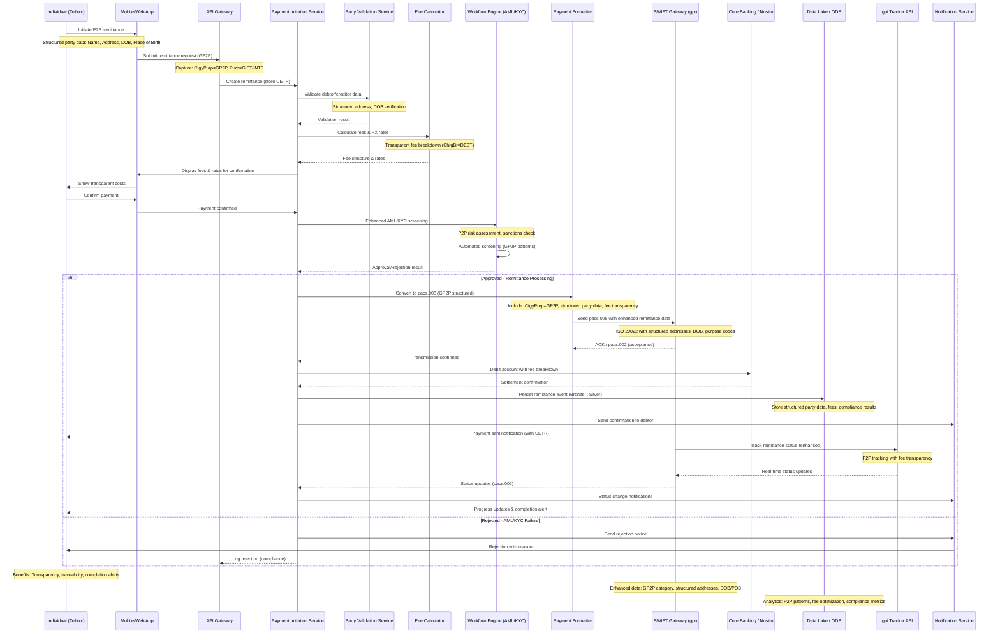

# Cross-Border Payment Level 0 - Sequence Diagram
## Enhanced for PMPG Use-Case 1a: Account to Account Remittances

## Use-Case 1a Enhancements

### Key Enhancements from PMPG Guidance

#### 1. Party Data Requirements
- **Structured Address Data**: Complete postal addresses for both debtor and creditor
- **Individual Identification**: Date of Birth (DOB) and Place of Birth in structured form
- **Natural Persons Only**: Both parties must be individuals, not legal entities

#### 2. ISO 20022 Message Structure
- **Category Purpose Code**: `GP2P` (General Person to Person)
- **Purpose Code**: `GIFT` (monetary gift) or `INTP` (intra-company payment)
- **Service Level**: `G001` (standard processing)
- **Charge Bearer**: `DEBT` (debtor pays all charges)

#### 3. Enhanced Processing Features
- **Fee Transparency**: Complete breakdown of all charges and FX rates upfront
- **Real-time Tracking**: Enhanced gpi tracking with P2P-specific status updates
- **Completion Alerts**: Proactive notifications to both debtor and creditor
- **AML/KYC Enhancement**: Specialized screening for P2P remittance patterns

#### 4. Customer Experience Improvements
- **Mobile-First Design**: Optimized for individual consumer usage
- **Transparent Costs**: All fees and rates displayed before confirmation
- **Progress Tracking**: Real-time status updates throughout payment lifecycle
- **Completion Confirmation**: Clear notification when funds are available

#### 5. Compliance & Risk Management
- **Enhanced Screening**: P2P-specific AML patterns and sanctions checking
- **Structured Data**: Better quality data for fraud prevention
- **Audit Trail**: Complete transaction history with compliance markers
- **Regulatory Alignment**: Support for local remittance regulations

### Benefits Delivered

#### For Individual Senders (Debtors)
- Complete fee and rate transparency before payment
- Real-time tracking with UETR reference
- Completion alerts when payment arrives
- Reduced likelihood of payment errors

#### For Individual Recipients (Creditors)
- Clear identification of payment sender
- Visibility into payment timing and fees
- Proactive notification of incoming funds

#### For Financial Institutions
- Reduced investigation and exception handling costs
- Improved fraud detection through better data quality
- Enhanced competitive position vs. non-bank providers
- Better regulatory compliance and reporting

### Technical Implementation Notes

#### Message Flow Enhancements
1. **Initial Capture**: Structured party data collection at source
2. **Validation**: Real-time validation of addresses and party information
3. **Fee Calculation**: Transparent cost computation with regulatory compliance
4. **Enhanced Screening**: P2P-specific risk assessment algorithms
5. **Status Tracking**: gpi-enabled tracking with consumer-friendly notifications

#### Data Quality Requirements
- All addresses must include structured elements (street, building, postal code, city, country)
- Individual identification must include DOB and place of birth
- Fee breakdown must be itemized and displayed in local currency
- UETR must be provided at payment initiation for end-to-end tracking
