# Cross-Border Payment Level 0 - Sequence Diagram
## Enhanced for PMPG Use-Case 1a: Account to Account Remittances
## 5-Stage, 14-Process-Step Lifecycle with BIAN Architecture

```mermaid
sequenceDiagram
    participant Individual as Individual (Debtor)
    participant MobileApp as Mobile/Web App
    participant CorpPortal as Corporate Portal
    participant APIGateway as API Gateway
    participant PaymentInitSvc as Payment Initiation Service
    participant FXGateway as FX Gateway
    participant PaymentDB as Payment DB/Kafka Ingestion
    participant WorkflowEngine as Workflow Engine (Camunda)
    participant ComplianceEngine as Compliance Engine (AML/OFAC)
    participant AuditService as Audit Service + Kafka
    participant PaymentFormatter as Payment Formatter Microservice
    participant SWIFTGateway as SWIFT Gateway Integration
    participant SWIFTNetwork as SWIFT Network
    participant gpiIntegration as gpi Integration Microservice
    participant BatchScheduler as Batch Job Scheduler + Retry Logic
    participant AzureSQL as Azure SQL/PostgreSQL (ODS)
    participant DataLake as Azure Data Lake/S3 + Databricks/Spark
    participant SearchAPI as Search API/Dashboard

    Note over Individual, SearchAPI: 🏛️ BIAN Service Domain Architecture with Data Medallion Pattern

    rect rgb(240, 248, 255)
        Note over Individual, PaymentDB: 📋 STAGE 1: PAYMENT INITIATION (Bronze Layer)
        
        Individual->>+MobileApp: 1. Initiate payment request (Web/API)
        Note right of Individual: 🎯 GP2P remittance with structured party data
        MobileApp->>+CorpPortal: Client initiates payment (MT101/pain.001 MX)
        Note over CorpPortal: 🔑 UETR generation, client details, account validation
        
        CorpPortal->>+APIGateway: Submit payment via API Gateway
        APIGateway->>+PaymentInitSvc: Create Payment Request
        
        PaymentInitSvc->>+FXGateway: 2. Validate payment details and FX rate
        Note over FXGateway: 🔍 FX checks, account coverage, duplicate prevention
        FXGateway-->>-PaymentInitSvc: FX validation result + rates
        
        PaymentInitSvc->>+PaymentDB: 3. Persist request with UETR for audit trail
        Note over PaymentDB: 💾 Immutable raw event record with UETR (Bronze)
        PaymentDB-->>-PaymentInitSvc: Persistence confirmation
        
        PaymentInitSvc-->>Individual: 💰 Display transparent fees & FX rates
        Note over Individual: 🎯 Target Benefit: Transparency of fees, rates and timing
    end

    rect rgb(248, 255, 248)
        Note over WorkflowEngine, AuditService: 📋 STAGE 2: PAYMENT APPROVAL (Silver Layer)
        
        PaymentInitSvc->>+WorkflowEngine: 4. Dual approval workflow (Maker-Checker)
        Note over WorkflowEngine: 🔄 Role-based approval logic, rejection comments
        WorkflowEngine->>WorkflowEngine: Human/automated approval decision
        
        WorkflowEngine->>+ComplianceEngine: 5. AML/OFAC screening
        Note over ComplianceEngine: 🛡️ Transaction risk scoring, sanction list checks
        ComplianceEngine->>ComplianceEngine: Enhanced P2P fraud screening
        ComplianceEngine-->>-WorkflowEngine: Compliance result
        Note over ComplianceEngine: 🎯 Target Benefit: Improved fraud screening
        
        WorkflowEngine->>+AuditService: 6. Status change & audit logging
        Note over AuditService: 📝 Approver ID, timestamp, digital signature
        AuditService-->>-WorkflowEngine: Audit logged
        
        WorkflowEngine-->>-PaymentInitSvc: Approval/rejection result
    end

    alt ✅ Payment Approved
        rect rgb(255, 248, 240)
            Note over PaymentFormatter, SWIFTNetwork: 📋 STAGE 3: PAYMENT GATEWAY (Silver Layer)
            
            PaymentInitSvc->>+PaymentFormatter: 7. Format message for legacy or ISO 20022
            Note over PaymentFormatter: 🔄 MT-MX mapping logic, schema validation (GP2P)
            PaymentFormatter->>PaymentFormatter: Convert to pacs.008 with structured party data
            
            PaymentFormatter->>+SWIFTGateway: 8. Send payment to SWIFT Network
            Note over SWIFTGateway: 🔐 Encryption, non-repudiation, confirmation receipt
            SWIFTGateway->>+SWIFTNetwork: Send pacs.008/MT103 with UETR
            Note over SWIFTNetwork: 📡 ISO 20022 message with GP2P category
            SWIFTNetwork-->>-SWIFTGateway: Transmission confirmation
            SWIFTGateway-->>-PaymentFormatter: SWIFT ACK received
            PaymentFormatter-->>-PaymentInitSvc: Gateway confirmation
        end

        rect rgb(255, 240, 255)
            Note over SWIFTNetwork, BatchScheduler: 📋 STAGE 4: ROUTING & EXECUTION (N/A → Gold)
            
            Note over SWIFTNetwork: 9. Routing via correspondent banks
            SWIFTNetwork->>SWIFTNetwork: UETR propagates via MT/MX messages
            Note over SWIFTNetwork: 🔗 Each hop updates status via gpi Tracker
            Note over SWIFTNetwork: 🎯 Target Benefit: Traceability & Payment accuracy
            
            SWIFTNetwork->>+gpiIntegration: 10. Retrieve real-time status via gpi API
            Note over gpiIntegration: 🔍 get_payment_status API every 4 hours
            gpiIntegration-->>-SWIFTNetwork: gpi status update
            
            gpiIntegration->>+BatchScheduler: 11. Retry logic if no update from gpi in 4 hours
            Note over BatchScheduler: ⏰ get_payment_status, track_payment API calls
            BatchScheduler->>BatchScheduler: Conditional trigger for gpi call
            BatchScheduler-->>-gpiIntegration: Batch retry completed
        end

        rect rgb(240, 255, 240)
            Note over AzureSQL, SearchAPI: 📋 STAGE 5: PAYMENT INTEGRATION (Gold Layer)
            
            gpiIntegration->>+AzureSQL: 12. Update ODS for operational dashboards
            Note over AzureSQL: 🏆 Latest status per payment (Gold layer - ODS)
            Note over AzureSQL: 🎯 Target Benefit: Latest status for CSRs, Ops, and clients
            AzureSQL-->>-gpiIntegration: ODS updated
            
            gpiIntegration->>+DataLake: 13. Store full history in Data Lake
            Note over DataLake: 📊 Enriched data for reconciliation, BI, fraud, SLA audits
            Note over DataLake: 🎯 Target Benefit: Reduced investigation costs
            DataLake-->>-gpiIntegration: Data Lake updated
            
            gpiIntegration->>+SearchAPI: 14. Client or Ops queries status by UETR
            Note over SearchAPI: 🔍 If not found → trigger gpi call for latest status
            SearchAPI->>SearchAPI: API triggers gpi call if payment not in ODS
            SearchAPI-->>Individual: 📱 Real-time status update & completion alert
            Note over Individual: 🎯 Target Benefits: Completion Alert & Clarity who payment is from
        end

    else ❌ Payment Rejected
        WorkflowEngine-->>PaymentInitSvc: Rejection with detailed reason
        PaymentInitSvc-->>Individual: 🚫 Rejection notice with compliance details
        PaymentInitSvc->>AuditService: Log rejection event
    end

    Note over Individual, SearchAPI: 🎯 TARGET BENEFITS ACHIEVED
    Note over Individual: ✅ Transparency: Upfront fees/rates display
    Note over Individual: ✅ Traceability: End-to-end UETR tracking via gpi
    Note over Individual: ✅ Completion Alert: Real-time notifications
    Note over SWIFTNetwork: ✅ Payment Accuracy: Structured data reduces errors
    Note over Individual: ✅ Sender Clarity: Enhanced party identification
    Note over DataLake: ✅ Reduced Investigations: Rich data quality
    Note over ComplianceEngine: ✅ Fraud Screening: P2P-specific risk patterns
    Note over SearchAPI: ✅ Product Effectiveness: Competitive vs non-bank providers

    Note over Individual, SearchAPI: 🏛️ BIAN DOMAINS: Payment Initiation, Payment Execution, Party Authentication, Fraud Detection
    Note over PaymentDB, DataLake: 🥉🥈🥇 DATA MEDALLION: Bronze (Raw) → Silver (Validated) → Gold (Analytics-Ready)
```

## Use-Case 1a Enhancements: 5-Stage Lifecycle with Target Benefits

### 14-Process-Step Mapping to Target Benefits

| Stage | Process Step | System/Tool | Data Layer | SWIFT Messages/API | Target Benefits Achieved |
|-------|--------------|-------------|------------|-------------------|-------------------------|
| **1. Payment Initiation** | 1. Client initiates payment request | Corporate Portal, API Gateway | Bronze | MT101/pain.001 (MX) | 🎯 **Transparency**: UETR generation, client details validation |
| | 2. Validate payment details and FX rate | Payment Initiation Service, FX Gateway | Bronze | — | 🎯 **Transparency**: Real-time FX rates, fee calculation |
| | 3. Persist request with UETR | Payment DB/Kafka Ingestion | Bronze | — | 🎯 **Traceability**: Immutable audit trail with UETR |
| **2. Payment Approval** | 4. Dual approval workflow | Workflow Engine (Camunda) | Silver | — | 🎯 **Payment Accuracy**: Role-based approval prevents errors |
| | 5. AML/OFAC screening | Compliance Engine | Silver | — | 🎯 **Fraud Screening**: Enhanced P2P risk patterns |
| | 6. Status change & audit logging | Audit Service + Kafka | Silver | — | 🎯 **Reduced Investigations**: Complete audit trail |
| **3. Payment Gateway** | 7. Format message for legacy/ISO 20022 | Payment Formatter Microservice | Silver | MT103/pacs.008 (MX) | 🎯 **Payment Accuracy**: Proper MT-MX mapping |
| | 8. Send payment to SWIFT Network | SWIFT Gateway Integration | Silver | Sent via SWIFT with UETR | 🎯 **Sender Clarity**: Structured party data transmission |
| **4. Routing & Execution** | 9. Routing via correspondent banks | SWIFT Network | N/A | UETR propagates via MT/MX | 🎯 **Traceability**: End-to-end UETR tracking |
| | 10. Retrieve real-time status | gpi Integration Microservice | Gold | get_payment_status API | 🎯 **Completion Alert**: Real-time status updates |
| | 11. Retry logic if no update | Batch Job Scheduler + Retry Logic | Bronze→Silver→Gold | get_payment_status, track_payment API | 🎯 **Product Effectiveness**: Reduced latency |
| **5. Payment Integration** | 12. Update ODS for dashboards | Azure SQL/PostgreSQL (ODS) | Gold | — | 🎯 **Transparency**: Latest status for CSRs, Ops, clients |
| | 13. Store full history in Data Lake | Azure Data Lake/S3 + Databricks | Gold | — | 🎯 **Reduced Investigations**: Rich analytics data |
| | 14. Client/Ops queries status by UETR | Search API/Dashboard | Gold | If not found → trigger gpi call | 🎯 **Completion Alert**: Proactive customer notifications |

### BIAN Service Domain Architecture Integration

#### Core BIAN Domains Implemented
- **Payment Initiation**: Client onboarding, payment instruction capture, UETR generation
- **Payment Execution**: SWIFT network integration, correspondent banking, settlement
- **Party Authentication**: Enhanced party validation with structured data (DOB, POB)
- **Fraud Detection**: P2P-specific AML/OFAC screening patterns
- **Customer Case Management**: Investigation reduction through enriched data
- **Product Deployment**: Competitive positioning vs non-bank providers

#### Data Medallion Architecture (Bronze → Silver → Gold)
- **Bronze Layer**: Raw event ingestion with immutable UETR audit trail
- **Silver Layer**: Validated, enriched data with compliance screening results
- **Gold Layer**: Analytics-ready data for operational dashboards and BI

### Target Benefits Achievement Matrix

#### ✅ Transparency of Fees, Rates and Timing
- **Process Steps 1-2**: Real-time FX rate calculation and fee breakdown display
- **Process Step 12**: Operational dashboard with latest payment status
- **Implementation**: Upfront cost display before payment confirmation

#### ✅ Traceability
- **Process Steps 3, 9**: UETR generation and end-to-end propagation
- **Process Steps 10-11**: Real-time gpi API tracking with retry logic
- **Implementation**: Complete payment journey visibility via UETR

#### ✅ Completion Alert
- **Process Steps 10, 14**: Real-time status updates and proactive notifications
- **Implementation**: Mobile push notifications and email alerts upon completion

#### ✅ Payment Accuracy (Low likelihood of misrouted payments)
- **Process Steps 4, 7**: Dual approval workflow and proper message formatting
- **Process Step 8**: Structured party data transmission via ISO 20022
- **Implementation**: Enhanced data quality reduces routing errors

#### ✅ Clarity who the payment is from
- **Process Step 8**: Structured party identification in SWIFT messages
- **Implementation**: Enhanced debtor information with DOB, POB, structured addresses

#### ✅ Reduced Investigation Costs
- **Process Steps 6, 13**: Complete audit logging and data lake storage
- **Implementation**: Rich data quality enables automated reconciliation

#### ✅ Improved Fraud Screening
- **Process Step 5**: P2P-specific AML/OFAC screening patterns
- **Implementation**: Enhanced risk scoring for remittance transactions

#### ✅ Improved Product Effectiveness
- **Process Steps 11-14**: Reduced latency through batch optimization and real-time queries
- **Implementation**: Competitive advantage through superior customer experience

### SWIFT Message Types and API Integration

#### Message Flow Mapping
1. **MT101/pain.001**: Initial payment instruction capture (Bronze layer)
2. **pacs.008**: Formatted payment message with GP2P category (Silver layer)
3. **MT103**: Legacy fallback format if required (Silver layer)
4. **pacs.002**: Status confirmations and updates (Gold layer)
5. **gpi APIs**: Real-time tracking and status retrieval (Gold layer)

#### API Integration Points
- `get_payment_status`: Real-time status retrieval every 4 hours
- `track_payment`: Enhanced tracking for P2P remittances
- Search API: UETR-based status queries with gpi fallback triggers
1. **Initial Capture**: Structured party data collection at source
2. **Validation**: Real-time validation of addresses and party information
3. **Fee Calculation**: Transparent cost computation with regulatory compliance
4. **Enhanced Screening**: P2P-specific risk assessment algorithms
5. **Status Tracking**: gpi-enabled tracking with consumer-friendly notifications

#### Data Quality Requirements
- All addresses must include structured elements (street, building, postal code, city, country)
- Individual identification must include DOB and place of birth
- Fee breakdown must be itemized and displayed in local currency
- UETR must be provided at payment initiation for end-to-end tracking
