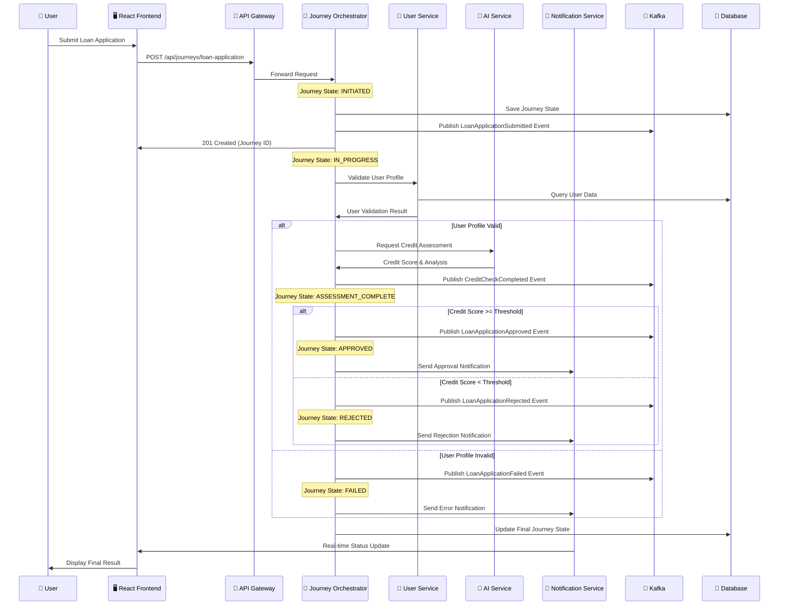
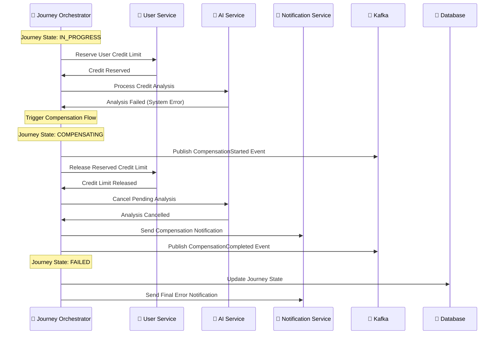
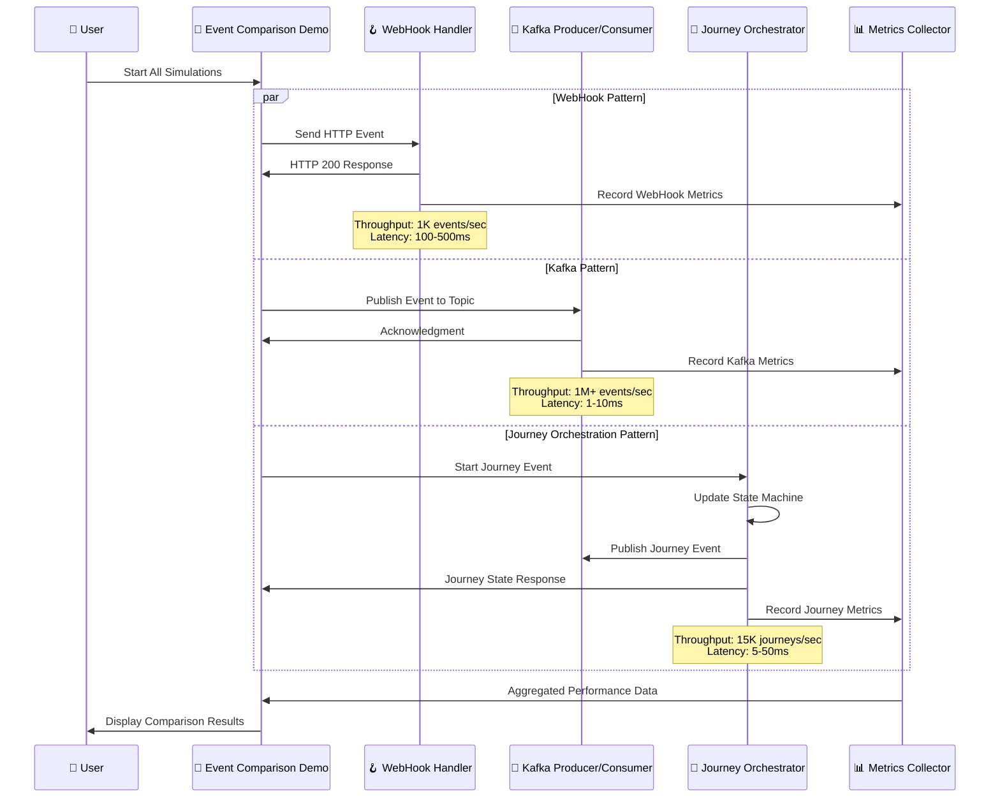
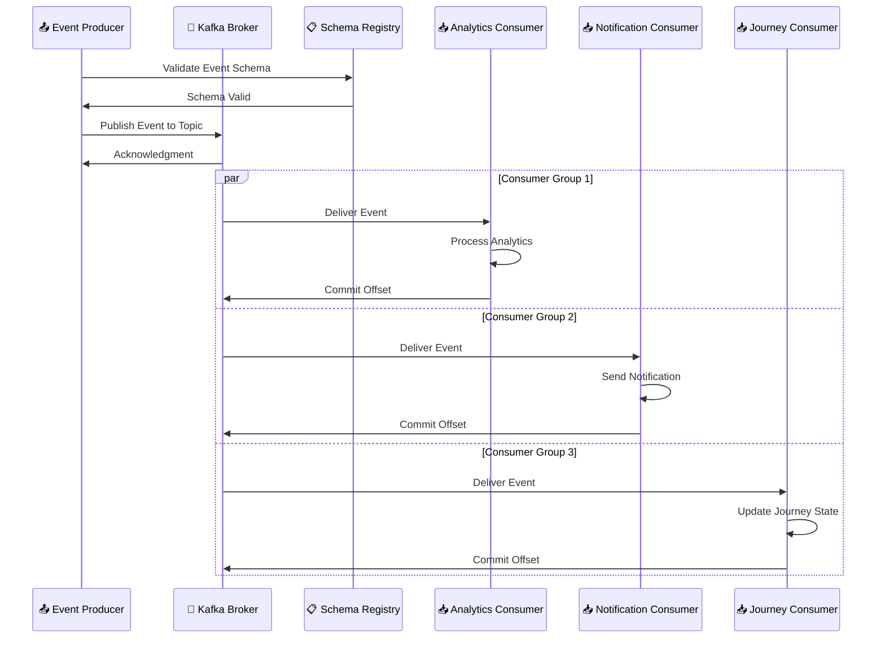
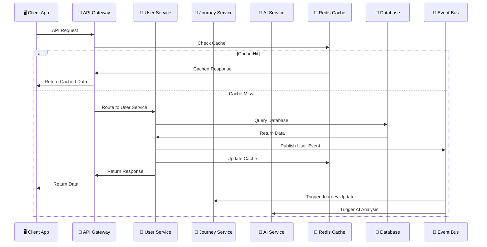
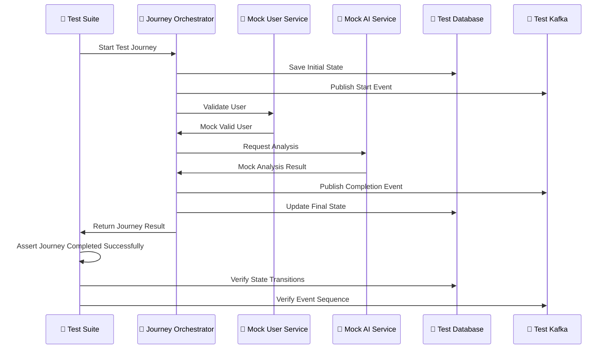
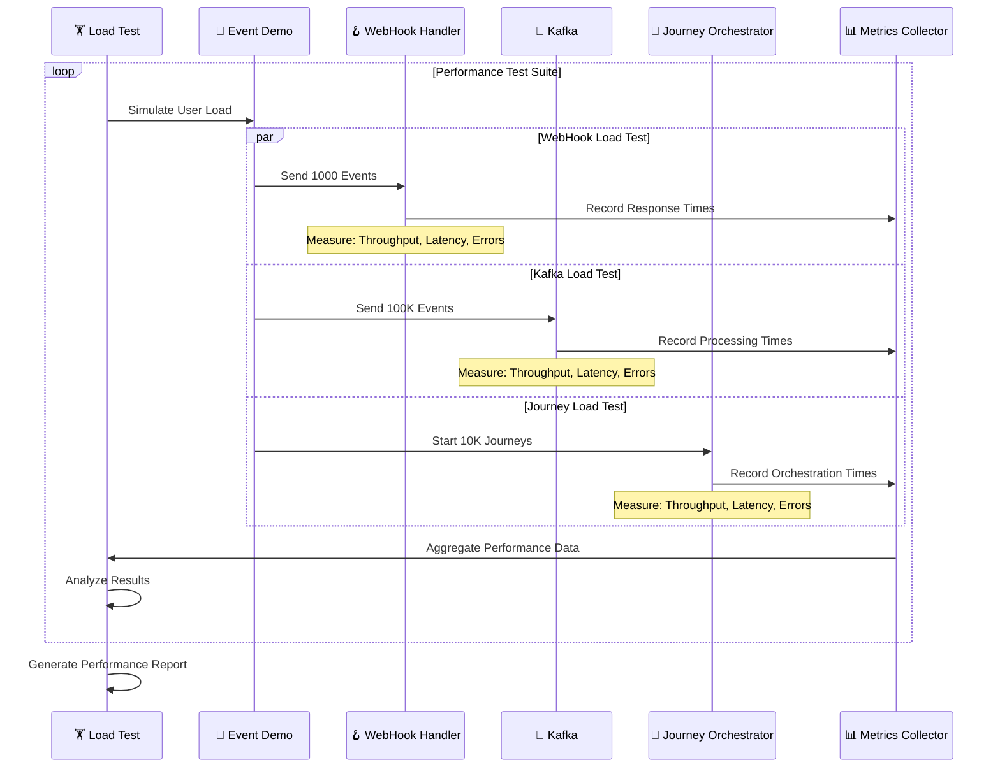
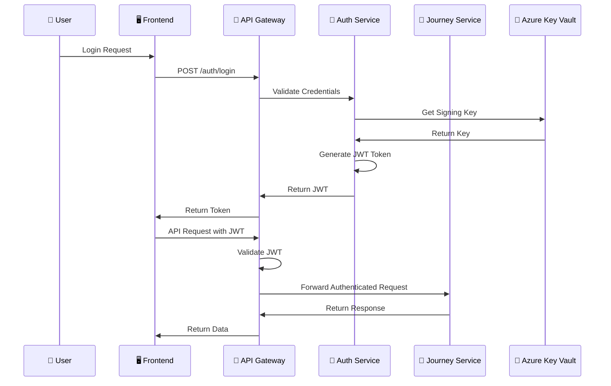
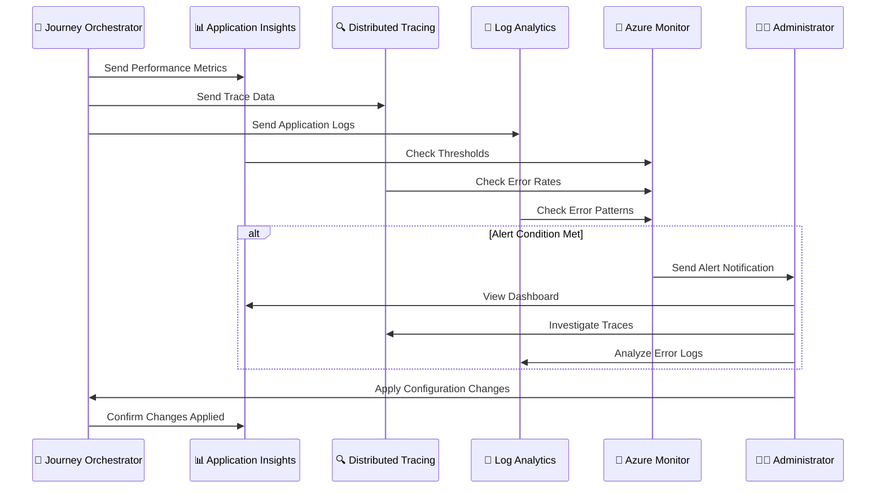

# 🎯 Journey Orchestrator Sequence Diagrams

> **Detailed workflow diagrams for the Journey Orchestrator service and event-driven patterns**

## 🔄 Journey Orchestration Workflows

### 1. 🏦 Loan Application Journey Flow

### 2. 🎭 Journey Compensation Flow (Saga Pattern)

### 3. ⚡ Event-Driven Architecture Comparison Flow

## 🌊 Event Flow Patterns

### 4. 📡 Event Publishing and Consumption

### 5. 🔄 Microservice Communication Flow

## 🧪 Testing Workflows

### 6. 🔬 Journey Testing Flow

### 7. 📊 Performance Testing Flow

## 🔒 Security and Monitoring Flows

### 8. 🛡️ Authentication and Authorization Flow

### 9. 📊 Monitoring and Observability Flow

## 📚 Related Documentation

- [Journey Orchestrator Implementation](../../backend/microservices/journey-orchestrator/README.md)
- [Event Comparison Demo](../../frontend/src/app/event-comparison/README.md)
- [Microservices Architecture](./microservices-architecture.md)
- [API Gateway Configuration](../../backend/microservices/api-gateway/README.md)

---

*These sequence diagrams provide detailed workflow documentation for implementing, testing, and monitoring the Journey Orchestrator and event-driven architecture patterns.*