# Cross-Border Payment L0 Overview - 5 Stages
## High-Level Stage Transitions with Key Actors

```mermaid
sequenceDiagram
    participant Customer as 👤 Customer
    participant Frontend as 📱 Frontend Systems
    participant PaymentCore as 💰 Payment Core
    participant ComplianceLayer as 🛡️ Compliance Layer
    participant SWIFTNetwork as 🌐 SWIFT Network
    participant DataPlatform as 📊 Data Platform

    Note over Customer, DataPlatform: 🏛️ Cross-Border Payment L0 - 5-Stage Overview

    rect rgb(240, 248, 255)
        Note over Customer, PaymentCore: 🚀 STAGE 1: PAYMENT INITIATION
        Customer->>Frontend: Initiate Payment Request
        Frontend->>PaymentCore: Create Payment with UETR
        PaymentCore-->>Customer: Fee Transparency & Confirmation
        Note right of Customer: ✅ Target: Transparency
    end

    rect rgb(248, 255, 248)
        Note over PaymentCore, ComplianceLayer: 📋 STAGE 2: PAYMENT APPROVAL
        PaymentCore->>ComplianceLayer: Dual Approval & AML Screening
        ComplianceLayer->>ComplianceLayer: Risk Assessment & Fraud Detection
        ComplianceLayer-->>PaymentCore: Approval Decision
        Note right of ComplianceLayer: ✅ Target: Fraud Screening
    end

    rect rgb(255, 248, 240)
        Note over PaymentCore, SWIFTNetwork: 🌐 STAGE 3: PAYMENT GATEWAY
        PaymentCore->>SWIFTNetwork: Format & Send (ISO 20022/MT)
        SWIFTNetwork->>SWIFTNetwork: Message Transmission
        SWIFTNetwork-->>PaymentCore: Transmission Confirmation
        Note right of SWIFTNetwork: ✅ Target: Payment Accuracy
    end

    rect rgb(255, 240, 255)
        Note over SWIFTNetwork, DataPlatform: 🔗 STAGE 4: ROUTING & EXECUTION
        SWIFTNetwork->>SWIFTNetwork: Multi-hop Routing via Correspondents
        SWIFTNetwork->>DataPlatform: gpi Status Updates (Real-time)
        DataPlatform->>DataPlatform: Status Tracking & Retry Logic
        Note right of DataPlatform: ✅ Target: Traceability
    end

    rect rgb(240, 255, 240)
        Note over DataPlatform, Customer: 📈 STAGE 5: PAYMENT INTEGRATION
        DataPlatform->>DataPlatform: Update ODS & Data Lake
        DataPlatform->>Frontend: Real-time Status Updates
        Frontend-->>Customer: Completion Alerts & Notifications
        Note right of Customer: ✅ Target: Completion Alert
    end

    Note over Customer, DataPlatform: 🎯 ALL TARGET BENEFITS ACHIEVED ACROSS 5 STAGES
    Note over Customer: 💎 Transparency • Traceability • Completion Alert
    Note over SWIFTNetwork: 🎯 Payment Accuracy • Sender Clarity • Reduced Investigations
    Note over ComplianceLayer: 🛡️ Fraud Screening • Product Effectiveness

```

## Stage Overview Summary

| Stage | Key Systems | Primary Focus | Target Benefits |
|-------|-------------|---------------|-----------------|
| **1. Initiation** | Frontend, Payment Core | Customer Experience | 🎯 Transparency of fees & rates |
| **2. Approval** | Compliance, Workflow | Risk Management | 🎯 Fraud Screening & Accuracy |
| **3. Gateway** | Payment Formatter, SWIFT | Message Transmission | 🎯 Payment Accuracy & Sender Clarity |
| **4. Routing** | SWIFT Network, gpi | End-to-end Execution | 🎯 Traceability & Status Updates |
| **5. Integration** | Data Platform, Analytics | Customer Communication | 🎯 Completion Alert & Investigation Reduction |

## Stage Transition Patterns

### Bronze → Silver → Gold Data Flow
- **Bronze (Stages 1-2)**: Raw event capture and initial validation
- **Silver (Stages 2-3)**: Enriched, validated, and formatted data
- **Gold (Stages 4-5)**: Analytics-ready data for operational dashboards

### BIAN Service Domain Alignment
- **Stage 1**: Payment Initiation Domain
- **Stage 2**: Party Authentication + Fraud Detection Domains
- **Stage 3**: Payment Execution Domain
- **Stage 4**: Payment Execution (Network) Domain
- **Stage 5**: Customer Case Management Domain

## Sub-Sequence Diagram References

For detailed process flows within each stage, refer to:
- [Stage 1: Payment Initiation](stage1-payment-initiation.md)
- [Stage 2: Payment Approval](stage2-payment-approval.md)
- [Stage 3: Payment Gateway](stage3-payment-gateway.md)
- [Stage 4: Routing & Execution](stage4-routing-execution.md)
- [Stage 5: Payment Integration](stage5-payment-integration.md)