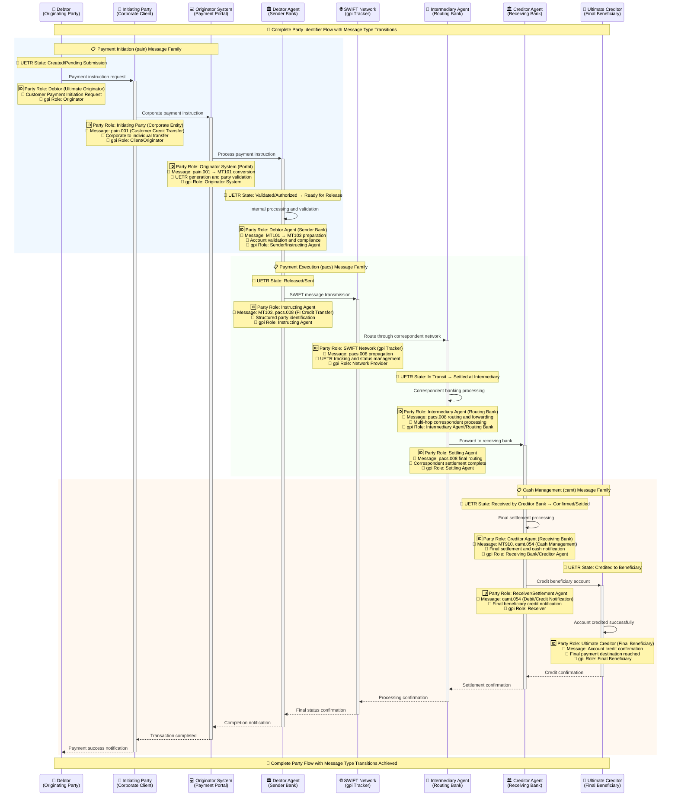

# Enhanced Party Identifier Flow - UETR Lifecycle
## Complete Message Type Transition from Payment Initiation (pain) to Cash Management (camt)



## Enhanced Party Identifier Mapping

### Complete Message Type Transition Flow

| Message Family | Message Type | Party Role | UETR State | gpi Role |
|----------------|-------------|------------|------------|----------|
| **pain (Payment Initiation)** | pain.001 | Debtor → Initiating Party → Originator System | Created/Pending → Validated | Originator → Client → System |
| **MT101 (Internal)** | MT101 | Debtor Agent (Internal Processing) | Validated → Ready for Release | Sender |
| **pacs (Payment Execution)** | MT103, pacs.008 | Instructing Agent → Intermediary → Creditor Agent | Released → In Transit → Received | Network Provider → Router → Receiver |
| **camt (Cash Management)** | MT910, camt.054 | Creditor Agent → Ultimate Creditor | Confirmed → Credited | Settlement Agent → Final Beneficiary |

### Party Role Evolution Throughout UETR Lifecycle

| Stage | Primary Party | Secondary Party | Message Type | UETR State Transition |
|-------|---------------|----------------|--------------|----------------------|
| **Initiation** | Debtor | Initiating Party | pain.001 | Created/Pending Submission |
| **Validation** | Originator System | Debtor Agent | MT101 | Validated/Authorized |
| **Preparation** | Debtor Agent | Approval Engine | MT103 prep | Ready for Release |
| **Transmission** | Instructing Agent | SWIFT Network | pacs.008 | Released/Sent |
| **Routing** | Intermediary Agent | Routing Banks | pacs.008 | In Transit |
| **Settlement** | Creditor Agent | Settlement Systems | MT910 | Confirmed/Settled |
| **Completion** | Ultimate Creditor | Final Beneficiary | camt.054 | Credited to Beneficiary |

### Enhanced Party Identification Structure

#### Originator Side (pain.001 → pacs.008)
```
Debtor (Individual/Corporate)
├── Initiating Party (Corporate Entity)
│   ├── Account Identification
│   ├── Structured Address Data
│   └── Contact Information
├── Originator System (Payment Portal)
│   ├── System Identification
│   ├── API Integration Points
│   └── UETR Generation
└── Debtor Agent (Sender Bank)
    ├── BIC Identification
    ├── Correspondent Relationships
    └── SWIFT Connectivity
```

#### Network Side (pacs.008 → pacs.008)
```
SWIFT Network (gpi Tracker)
├── Instructing Agent (Entry Point)
│   ├── Network Entry Validation
│   ├── gpi Tracker Registration
│   └── Status Tracking Initiation
├── Intermediary Agents (Routing)
│   ├── Correspondent Bank Network
│   ├── Multi-hop Routing Logic
│   └── Settlement at Intermediary
└── Network Optimization
    ├── Route Selection
    ├── Cost Optimization
    └── Speed vs Cost Trade-offs
```

#### Beneficiary Side (pacs.008 → camt.054)
```
Creditor Agent (Receiving Bank)
├── Receiving Bank Processing
│   ├── Account Validation
│   ├── KYC Verification
│   └── Local Compliance
├── Settlement Operations
│   ├── Final Settlement (MT910)
│   ├── Cash Management (camt.054)
│   └── Fee Reconciliation
└── Ultimate Creditor (Final Beneficiary)
    ├── Account Identification
    ├── Beneficiary Validation
    └── Final Credit Confirmation
```

### gpi Role Mapping Throughout Message Flow

| Message Transition | From gpi Role | To gpi Role | Party Transition | UETR State Change |
|---------------------|---------------|-------------|------------------|-------------------|
| **pain.001 → MT101** | Originator | Client/Originator | Debtor → Initiating Party | Created → Validated |
| **MT101 → MT103** | Client/Originator | Sender | Originator System → Debtor Agent | Validated → Ready |
| **MT103 → pacs.008** | Sender | Instructing Agent | Debtor Agent → SWIFT Network | Ready → Released |
| **pacs.008 → pacs.008** | Instructing Agent | Intermediary Agent | SWIFT Network → Routing Bank | Released → In Transit |
| **pacs.008 → MT910** | Intermediary Agent | Creditor Agent | Routing Bank → Receiving Bank | In Transit → Received |
| **MT910 → camt.054** | Creditor Agent | Receiver | Receiving Bank → Settlement Agent | Received → Confirmed |
| **camt.054 → Credit** | Receiver | Final Beneficiary | Settlement Agent → Ultimate Creditor | Confirmed → Credited |

### Enhanced Structured Address Requirements

#### ISO 20022 Party Identification Enhancement
```json
{
  "partyIdentification": {
    "debtorParty": {
      "name": "Corporate Entity Name",
      "postalAddress": {
        "addressType": "ADDR",
        "streetName": "123 Business Street",
        "buildingNumber": "Suite 100",
        "townName": "Financial District",
        "countrySubDivision": "State/Province",
        "country": "US",
        "postCode": "12345"
      },
      "dateOfBirth": "1985-06-15",
      "placeOfBirth": {
        "cityOfBirth": "New York",
        "countryOfBirth": "US"
      },
      "contactDetails": {
        "phoneNumber": "+1-555-123-4567",
        "emailAddress": "corporate@company.com"
      }
    },
    "creditorParty": {
      "name": "Individual Beneficiary Name",
      "postalAddress": {
        "addressType": "HOME",
        "streetName": "456 Residential Avenue",
        "buildingNumber": "Apt 25B",
        "townName": "Suburb City",
        "countrySubDivision": "State/Province",
        "country": "GB",
        "postCode": "SW1A 1AA"
      },
      "identification": {
        "organisationIdentification": {
          "bicFi": "DEUTDEFF",
          "clearingSystemMemberIdentification": {
            "clearingSystemIdentification": "USABA",
            "memberIdentification": "123456789"
          }
        }
      }
    }
  }
}
```

## Target Benefits Achievement Through Enhanced Party Flow

### ✅ Clarity Who the Payment is From
- **Enhanced Party Identification**: Structured debtor information with DOB, POB, and complete address data
- **Message Flow**: pain.001 → pacs.008 with comprehensive originator details
- **gpi Integration**: Complete originator tracking throughout UETR lifecycle

### ✅ UETR Traceability
- **End-to-End Tracking**: Complete party transitions from Debtor to Ultimate Creditor
- **Message Correlation**: pain.001 → MT103 → pacs.008 → camt.054 with preserved UETR
- **Party State Management**: Each party role clearly defined with UETR state transitions

### ✅ Payment Accuracy
- **Structured Party Data**: Enhanced validation and routing accuracy
- **Multi-hop Clarity**: Clear correspondent banking relationships and routing
- **Final Beneficiary Validation**: Complete creditor agent and ultimate creditor verification

### ✅ Investigation Reduction
- **Complete Party Audit Trail**: Full party transition history with timestamps
- **Enhanced Party Documentation**: Structured addresses and contact information
- **Self-Service Tracking**: Complete party flow visibility for customer support