# Enhanced Party Identifier Flow - UETR Lifecycle
## Complete Message Type Transition from Payment Initiation (pain) to Cash Management (camt)

```mermaid
sequenceDiagram
    participant Debtor as 👤 Debtor<br/>(Originating Party)
    participant InitiatingParty as 🏢 Initiating Party<br/>(Corporate Client)
    participant OriginatorSystem as 💻 Originator System<br/>(Payment Portal)
    participant DebtorAgent as 🏛️ Debtor Agent<br/>(Sender Bank)
    participant SWIFTNetwork as 🌐 SWIFT Network<br/>(gpi Tracker)
    participant IntermediaryAgent as 🏦 Intermediary Agent<br/>(Routing Bank)
    participant CreditorAgent as 🏛️ Creditor Agent<br/>(Receiving Bank)
    participant UltimateCreditor as 👤 Ultimate Creditor<br/>(Final Beneficiary)

    Note over Debtor, UltimateCreditor: 🔄 Complete Party Identifier Flow with Message Type Transitions

    rect rgb(240, 248, 255)
        Note over Debtor, OriginatorSystem: 📋 Payment Initiation (pain) Message Family
        
        Note over Debtor: 🔄 UETR State: Created/Pending Submission
        Debtor->>+InitiatingParty: Payment instruction request
        Note over Debtor: 🆔 Party Role: Debtor (Ultimate Originator)<br/>📄 Customer Payment Initiation Request<br/>🔑 gpi Role: Originator
        
        InitiatingParty->>+OriginatorSystem: Corporate payment instruction
        Note over InitiatingParty: 🆔 Party Role: Initiating Party (Corporate Entity)<br/>📄 Message: pain.001 (Customer Credit Transfer)<br/>🔑 Corporate to individual transfer<br/>🎯 gpi Role: Client/Originator
        
        OriginatorSystem->>+DebtorAgent: Process payment instruction
        Note over OriginatorSystem: 🆔 Party Role: Originator System (Portal)<br/>📄 Message: pain.001 → MT101 conversion<br/>🔑 UETR generation and party validation<br/>🎯 gpi Role: Originator System
        
        Note over DebtorAgent: 🔄 UETR State: Validated/Authorized → Ready for Release
        DebtorAgent->>DebtorAgent: Internal processing and validation
        Note over DebtorAgent: 🆔 Party Role: Debtor Agent (Sender Bank)<br/>📄 Message: MT101 → MT103 preparation<br/>🔑 Account validation and compliance<br/>🎯 gpi Role: Sender/Instructing Agent
    end

    rect rgb(248, 255, 248)
        Note over DebtorAgent, SWIFTNetwork: 📋 Payment Execution (pacs) Message Family
        
        Note over DebtorAgent: 🔄 UETR State: Released/Sent
        DebtorAgent->>+SWIFTNetwork: SWIFT message transmission
        Note over DebtorAgent: 🆔 Party Role: Instructing Agent<br/>📄 Message: MT103, pacs.008 (FI Credit Transfer)<br/>🔑 Structured party identification<br/>🎯 gpi Role: Instructing Agent
        
        SWIFTNetwork->>+IntermediaryAgent: Route through correspondent network
        Note over SWIFTNetwork: 🆔 Party Role: SWIFT Network (gpi Tracker)<br/>📄 Message: pacs.008 propagation<br/>🔑 UETR tracking and status management<br/>🎯 gpi Role: Network Provider
        
        Note over IntermediaryAgent: 🔄 UETR State: In Transit → Settled at Intermediary
        IntermediaryAgent->>IntermediaryAgent: Correspondent banking processing
        Note over IntermediaryAgent: 🆔 Party Role: Intermediary Agent (Routing Bank)<br/>📄 Message: pacs.008 routing and forwarding<br/>🔑 Multi-hop correspondent processing<br/>🎯 gpi Role: Intermediary Agent/Routing Bank
        
        IntermediaryAgent->>+CreditorAgent: Forward to receiving bank
        Note over IntermediaryAgent: 🆔 Party Role: Settling Agent<br/>📄 Message: pacs.008 final routing<br/>🔑 Correspondent settlement complete<br/>🎯 gpi Role: Settling Agent
    end

    rect rgb(255, 248, 240)
        Note over CreditorAgent, UltimateCreditor: 📋 Cash Management (camt) Message Family
        
        Note over CreditorAgent: 🔄 UETR State: Received by Creditor Bank → Confirmed/Settled
        CreditorAgent->>CreditorAgent: Final settlement processing
        Note over CreditorAgent: 🆔 Party Role: Creditor Agent (Receiving Bank)<br/>📄 Message: MT910, camt.054 (Cash Management)<br/>🔑 Final settlement and cash notification<br/>🎯 gpi Role: Receiving Bank/Creditor Agent
        
        Note over UltimateCreditor: 🔄 UETR State: Credited to Beneficiary
        CreditorAgent->>+UltimateCreditor: Credit beneficiary account
        Note over CreditorAgent: 🆔 Party Role: Receiver/Settlement Agent<br/>📄 Message: camt.054 (Debit/Credit Notification)<br/>🔑 Final beneficiary credit notification<br/>🎯 gpi Role: Receiver
        
        UltimateCreditor->>UltimateCreditor: Account credited successfully
        Note over UltimateCreditor: 🆔 Party Role: Ultimate Creditor (Final Beneficiary)<br/>📄 Message: Account credit confirmation<br/>🔑 Final payment destination reached<br/>🎯 gpi Role: Final Beneficiary
        
        UltimateCreditor-->>-CreditorAgent: Credit confirmation
        CreditorAgent-->>-IntermediaryAgent: Settlement confirmation
        IntermediaryAgent-->>-SWIFTNetwork: Processing confirmation
        SWIFTNetwork-->>-DebtorAgent: Final status confirmation
        DebtorAgent-->>-OriginatorSystem: Completion notification
        OriginatorSystem-->>-InitiatingParty: Transaction completed
        InitiatingParty-->>-Debtor: Payment success notification
    end

    Note over Debtor, UltimateCreditor: 🎯 Complete Party Flow with Message Type Transitions Achieved

```



## Enhanced Party Identifier Mapping

### Complete Message Type Transition Flow

| Message Family | Message Type | Party Role | UETR State | gpi Role |
|----------------|-------------|------------|------------|----------|
| **pain (Payment Initiation)** | pain.001 | Debtor → Initiating Party → Originator System | Created/Pending → Validated | Originator → Client → System |
| **MT101 (Internal)** | MT101 | Debtor Agent (Internal Processing) | Validated → Ready for Release | Sender |
| **pacs (Payment Execution)** | MT103, pacs.008 | Instructing Agent → Intermediary → Creditor Agent | Released → In Transit → Received | Network Provider → Router → Receiver |
| **camt (Cash Management)** | MT910, camt.054 | Creditor Agent → Ultimate Creditor | Confirmed → Credited | Settlement Agent → Final Beneficiary |

### Party Role Evolution Throughout UETR Lifecycle

| Stage | Primary Party | Secondary Party | Message Type | UETR State Transition |
|-------|---------------|----------------|--------------|----------------------|
| **Initiation** | Debtor | Initiating Party | pain.001 | Created/Pending Submission |
| **Validation** | Originator System | Debtor Agent | MT101 | Validated/Authorized |
| **Preparation** | Debtor Agent | Approval Engine | MT103 prep | Ready for Release |
| **Transmission** | Instructing Agent | SWIFT Network | pacs.008 | Released/Sent |
| **Routing** | Intermediary Agent | Routing Banks | pacs.008 | In Transit |
| **Settlement** | Creditor Agent | Settlement Systems | MT910 | Confirmed/Settled |
| **Completion** | Ultimate Creditor | Final Beneficiary | camt.054 | Credited to Beneficiary |

### Enhanced Party Identification Structure

#### Originator Side (pain.001 → pacs.008)
```
Debtor (Individual/Corporate)
├── Initiating Party (Corporate Entity)
│   ├── Account Identification
│   ├── Structured Address Data
│   └── Contact Information
├── Originator System (Payment Portal)
│   ├── System Identification
│   ├── API Integration Points
│   └── UETR Generation
└── Debtor Agent (Sender Bank)
    ├── BIC Identification
    ├── Correspondent Relationships
    └── SWIFT Connectivity
```

#### Network Side (pacs.008 → pacs.008)
```
SWIFT Network (gpi Tracker)
├── Instructing Agent (Entry Point)
│   ├── Network Entry Validation
│   ├── gpi Tracker Registration
│   └── Status Tracking Initiation
├── Intermediary Agents (Routing)
│   ├── Correspondent Bank Network
│   ├── Multi-hop Routing Logic
│   └── Settlement at Intermediary
└── Network Optimization
    ├── Route Selection
    ├── Cost Optimization
    └── Speed vs Cost Trade-offs
```

#### Beneficiary Side (pacs.008 → camt.054)
```
Creditor Agent (Receiving Bank)
├── Receiving Bank Processing
│   ├── Account Validation
│   ├── KYC Verification
│   └── Local Compliance
├── Settlement Operations
│   ├── Final Settlement (MT910)
│   ├── Cash Management (camt.054)
│   └── Fee Reconciliation
└── Ultimate Creditor (Final Beneficiary)
    ├── Account Identification
    ├── Beneficiary Validation
    └── Final Credit Confirmation
```

### gpi Role Mapping Throughout Message Flow

| Message Transition | From gpi Role | To gpi Role | Party Transition | UETR State Change |
|---------------------|---------------|-------------|------------------|-------------------|
| **pain.001 → MT101** | Originator | Client/Originator | Debtor → Initiating Party | Created → Validated |
| **MT101 → MT103** | Client/Originator | Sender | Originator System → Debtor Agent | Validated → Ready |
| **MT103 → pacs.008** | Sender | Instructing Agent | Debtor Agent → SWIFT Network | Ready → Released |
| **pacs.008 → pacs.008** | Instructing Agent | Intermediary Agent | SWIFT Network → Routing Bank | Released → In Transit |
| **pacs.008 → MT910** | Intermediary Agent | Creditor Agent | Routing Bank → Receiving Bank | In Transit → Received |
| **MT910 → camt.054** | Creditor Agent | Receiver | Receiving Bank → Settlement Agent | Received → Confirmed |
| **camt.054 → Credit** | Receiver | Final Beneficiary | Settlement Agent → Ultimate Creditor | Confirmed → Credited |

### Enhanced Structured Address Requirements

#### ISO 20022 Party Identification Enhancement
```json
{
  "partyIdentification": {
    "debtorParty": {
      "name": "Corporate Entity Name",
      "postalAddress": {
        "addressType": "ADDR",
        "streetName": "123 Business Street",
        "buildingNumber": "Suite 100",
        "townName": "Financial District",
        "countrySubDivision": "State/Province",
        "country": "US",
        "postCode": "12345"
      },
      "dateOfBirth": "1985-06-15",
      "placeOfBirth": {
        "cityOfBirth": "New York",
        "countryOfBirth": "US"
      },
      "contactDetails": {
        "phoneNumber": "+1-555-123-4567",
        "emailAddress": "corporate@company.com"
      }
    },
    "creditorParty": {
      "name": "Individual Beneficiary Name",
      "postalAddress": {
        "addressType": "HOME",
        "streetName": "456 Residential Avenue",
        "buildingNumber": "Apt 25B",
        "townName": "Suburb City",
        "countrySubDivision": "State/Province",
        "country": "GB",
        "postCode": "SW1A 1AA"
      },
      "identification": {
        "organisationIdentification": {
          "bicFi": "DEUTDEFF",
          "clearingSystemMemberIdentification": {
            "clearingSystemIdentification": "USABA",
            "memberIdentification": "123456789"
          }
        }
      }
    }
  }
}
```

## Target Benefits Achievement Through Enhanced Party Flow

### ✅ Clarity Who the Payment is From
- **Enhanced Party Identification**: Structured debtor information with DOB, POB, and complete address data
- **Message Flow**: pain.001 → pacs.008 with comprehensive originator details
- **gpi Integration**: Complete originator tracking throughout UETR lifecycle

### ✅ UETR Traceability
- **End-to-End Tracking**: Complete party transitions from Debtor to Ultimate Creditor
- **Message Correlation**: pain.001 → MT103 → pacs.008 → camt.054 with preserved UETR
- **Party State Management**: Each party role clearly defined with UETR state transitions

### ✅ Payment Accuracy
- **Structured Party Data**: Enhanced validation and routing accuracy
- **Multi-hop Clarity**: Clear correspondent banking relationships and routing
- **Final Beneficiary Validation**: Complete creditor agent and ultimate creditor verification

### ✅ Investigation Reduction
- **Complete Party Audit Trail**: Full party transition history with timestamps
- **Enhanced Party Documentation**: Structured addresses and contact information
- **Self-Service Tracking**: Complete party flow visibility for customer support