# Stage 1: Payment Initiation - Enhanced UETR Lifecycle
## Detailed Process Flow with UETR State Management and MT/MX Message Integration

```mermaid
sequenceDiagram
    participant Debtor as 👤 Debtor<br/>(Initiating Party)
    participant MobileApp as 📱 Mobile/Web App
    participant Portal as 🌐 Corporate Portal<br/>(Originator System)
    participant API as 🔌 API Gateway
    participant PaymentInitSvc as 💰 Payment Initiation Service
    participant FXGateway as 💱 FX Gateway
    participant PaymentDB as �️ Payment DB/Kafka
    participant PaymentSystem as 🏛️ Payment System<br/>(UETR Management)

    Note over Debtor, PaymentSystem: 🚀 STAGE 1: PAYMENT INITIATION - UETR Lifecycle Steps 1.1-1.3

    rect rgb(240, 248, 255)
        Note over Debtor, MobileApp: 📋 Step 1.1: Payment Request Initiation
        Note over Debtor: 🔄 UETR State: Created/Pending Submission
        
        Debtor->>+MobileApp: Initiate GP2P remittance request
        Note right of Debtor: • Corporate to Individual transfer<br/>• Structured party data required<br/>• DOB, POB, enhanced addresses<br/>• gpi Role: Originator
        
        MobileApp->>+Portal: Submit payment instruction via UI
        Note over Portal: 📄 Message Type: pain.001 (Customer Payment)<br/>🔑 Initial UETR generation (UUID v4-128 bits)<br/>💾 Payment instruction captured<br/>🎯 gpi Role: Client/Originator System
        
        Portal->>+API: Create payment via REST API
        API->>+PaymentInitSvc: Process payment request with UETR
        
        PaymentInitSvc->>PaymentInitSvc: Generate immutable UETR
        Note right of PaymentInitSvc: 🆔 UETR Format: {BIC}{YYYYMMDD}{Random}<br/>📊 ISO 20022 compliant identifier<br/>🔒 Immutable throughout lifecycle
        
        PaymentInitSvc-->>API: UETR + payment summary
        API-->>Portal: Display payment details
        Portal-->>MobileApp: Show payment preview
        MobileApp-->>Debtor: 💰 Transparent fee & FX preview
        Note left of Debtor: ✅ TARGET ACHIEVED: Fee Transparency
    end

    rect rgb(248, 255, 248)
        Note over PaymentInitSvc, FXGateway: 📋 Step 1.2: Internal Validations & Authorization
        Note over PaymentInitSvc: 🔄 UETR State: Validated/Authorized
        
        PaymentInitSvc->>+FXGateway: Validate payment details + FX calculation
        Note over FXGateway: 💹 FX rate calculation & account coverage<br/>🔍 Duplicate payment prevention<br/>📋 Account balance verification<br/>🎯 gpi Role: Validation Engine
        
        FXGateway->>FXGateway: Perform comprehensive validations
        Note right of FXGateway: • Account coverage validation<br/>• Daily/monthly limit checks<br/>• Duplicate transaction screening<br/>• FX rate lock and calculation<br/>• Regulatory compliance pre-check
        
        FXGateway-->>-PaymentInitSvc: Validation results + approvals
        Note over PaymentInitSvc: 📄 Message: MT101 (Request for Transfer)<br/>🔑 Internal format preparation<br/>💾 Validation status recorded
        
        PaymentInitSvc-->>Debtor: Display final cost breakdown
        Note over Debtor: 🎯 Target Benefit: Complete transparency<br/>💰 Total fees, FX rates, delivery timeline
    end

    rect rgb(255, 248, 240)
        Note over PaymentInitSvc, PaymentDB: 📋 Step 1.3: Message Staging & Persistence
        Note over PaymentSystem: 🔄 UETR State: Registered/Staged
        
        PaymentInitSvc->>+PaymentSystem: Stage message with validated UETR
        Note over PaymentSystem: 📄 Message: MT101 (:50a, :52a tags)<br/>🔑 Message staged but not sent to SWIFT<br/>💾 Ready for approval workflow<br/>🎯 gpi Role: Initiating Bank
        
        PaymentSystem->>+PaymentDB: Persist with immutable audit trail
        Note over PaymentDB: 🗄️ Bronze Layer: Raw event storage<br/>📊 Immutable UETR audit trail<br/>🕒 Timestamp + source system tracking<br/>🔍 Complete payment lineage capture
        
        PaymentDB-->>-PaymentSystem: Persistence confirmation
        PaymentSystem-->>-PaymentInitSvc: Staging confirmation with UETR
        
        PaymentInitSvc-->>API: Payment staged successfully
        API-->>Portal: Staging status update
        Portal-->>MobileApp: Payment queued for approval
        MobileApp-->>Debtor: 📋 Payment staged with UETR reference
        Note left of Debtor: 🎯 Target Benefit: UETR Traceability<br/>🔍 Unique reference for lifecycle tracking
    end

    Note over Debtor, PaymentSystem: 🎯 STAGE 1 TARGET BENEFITS ACHIEVED
    Note over Debtor: ✅ Fee Transparency: Complete cost breakdown displayed
    Note over PaymentInitSvc: ✅ UETR Traceability: Immutable reference generated
    Note over PaymentDB: ✅ Audit Trail: Bronze layer event capture complete

```



## Enhanced Stage 1 UETR State Management

### UETR State Transitions in Stage 1

| Step | UETR State | Description | MT Message | MX Message | Key Parties |
|------|------------|-------------|------------|------------|-------------|
| **1.1** | **Created/Pending Submission** | Payment initiated but not validated | - | pain.001 | Debtor, Initiating Party, Originator System |
| **1.2** | **Validated/Authorized** | Internal validations completed successfully | MT101 | - | Originator System, FX Gateway, Debtor Agent |
| **1.3** | **Registered/Staged** | Message staged but not sent to SWIFT | MT101 | - | Payment System, Initiating Bank |

### Message Type Progression

| Message Transition | Purpose | UETR State Change | Technical Details |
|---------------------|---------|-------------------|-------------------|
| **Initial → pain.001** | Customer payment instruction capture | → Created/Pending | ISO 20022 message with party data |
| **pain.001 → MT101** | Internal bank format preparation | → Validated/Authorized | Bank-specific validation format |
| **MT101 → Staged** | Ready for approval workflow | → Registered/Staged | Message queued for next stage |

### Party Role and gpi Integration

| Party | gpi Role | UETR States | Key Responsibilities |
|-------|----------|-------------|---------------------|
| **Debtor** | Originator | Created/Pending | Payment instruction initiation |
| **Mobile/Web App** | Client Interface | Created/Pending | User experience and data capture |
| **Corporate Portal** | Originator System | Created/Pending → Validated | Payment instruction processing |
| **FX Gateway** | Validation Engine | Validated/Authorized | Account and compliance validation |
| **Payment System** | Initiating Bank | Registered/Staged | Message staging and workflow preparation |

## Stage 1 Process Steps Summary - Enhanced

| Step | Process | System | UETR State | Target Benefit |
|------|---------|--------|------------|----------------|
| **1.1** | Payment Request Initiation | Mobile App + Portal | Created/Pending Submission | Data Capture + UETR Generation |
| **1.2** | Internal Validations | FX Gateway + Validation | Validated/Authorized | ✅ **Fee Transparency** |
| **1.3** | Message Staging | Payment System + DB | Registered/Staged | ✅ **UETR Traceability** |
| **1.5** | Workflow Initiation | Camunda BPMN Engine | Process Orchestration |
| **1.6** | Initial Compliance Check | Compliance Engine | Risk Assessment |
| **1.7** | Data Events (Bronze) | Kafka + Data Lake | Audit Trail |
| **1.8** | Customer Confirmation | Frontend Systems | User Experience |

## Key Technical Components

### PMPG Use-Case 1a Compliance
- **Category Purpose**: GP2P (General Person-to-Person)
- **Sender Type**: Corporate Entity
- **Receiver Type**: Natural Person
- **Structured Data**: Date of Birth, Place of Birth when required

### ISO 20022 Message Preparation
- **Base Message**: pain.001.001.xx (Customer Credit Transfer Initiation)
- **Key Elements**: UETR, Structured Address, Category Purpose
- **Fee Transparency**: All fees disclosed upfront per regulation

### BIAN Service Domains
- **Payment Initiation**: Primary domain for this stage
- **Party Authentication**: Customer login and verification
- **Product Deployment**: Fee calculation and product configuration

## Data Architecture - Bronze Layer

### Event Schema
```json
{
  "eventType": "Payment.Initiated",
  "uetr": "DEUTDEFFXXX20241115RND123456",
  "timestamp": "2024-01-15T10:30:00Z",
  "payload": {
    "sender": "Corporate Entity",
    "receiver": "Natural Person",
    "amount": "1000.00",
    "currency": "USD",
    "categoryPurpose": "GP2P"
  }
}
```

## Next Stage
➡️ [Stage 2: Payment Approval](stage2-payment-approval.md) - Dual approval and enhanced fraud screening