# Stage 1: Payment Initiation
## Detailed Process Flow - Payment Initiation and Initial Validation

```mermaid
sequenceDiagram
    participant Customer as 👤 Customer
    participant Portal as 🌐 Corporate Portal
    participant API as 🔌 API Gateway
    participant PaymentInitSvc as 💰 Payment Initiation Service
    participant WorkflowEngine as ⚙️ Workflow Engine (Camunda)
    participant ComplianceEngine as 🛡️ Compliance Engine
    participant DataLake as 🏛️ Data Lake (Bronze)
    participant KafkaEvents as 📨 Kafka Events

    Note over Customer, KafkaEvents: 🚀 STAGE 1: PAYMENT INITIATION (Target: Transparency & Risk Assessment)

    %% Process Step 1: Corporate User Login
    Customer->>Portal: Corporate User Login (OAuth 2.0)
    Portal->>API: Authenticate & Generate JWT Token
    API-->>Portal: JWT Token + Role Permissions
    Portal-->>Customer: Authentication Success

    %% Process Step 2: Payment Instruction Entry
    activate Customer
    Customer->>Portal: Enter Payment Details (PMPG-1a: GP2P Remittance)
    Note right of Customer: • Sender: Corporate Entity<br/>• Receiver: Natural Person<br/>• Purpose: GP2P (General Person-to-Person)
    Portal->>API: Validate Input & Fee Calculation
    API->>PaymentInitSvc: Create Payment Instruction
    activate PaymentInitSvc

    %% Process Step 3: UETR Generation
    PaymentInitSvc->>PaymentInitSvc: Generate UETR (Unique End-to-End Transaction Reference)
    Note right of PaymentInitSvc: ISO 20022 Compliant UETR<br/>Format: {BIC}{YYYYMMDD}{Random}

    %% Process Step 4: Fee Transparency
    PaymentInitSvc->>PaymentInitSvc: Calculate Total Fees & FX Rates
    PaymentInitSvc-->>API: Fee Breakdown + Total Amount
    API-->>Portal: Display Fee Transparency
    Portal-->>Customer: Show Total Cost & Delivery Time
    Note left of Customer: ✅ TARGET ACHIEVED:<br/>Fee Transparency

    %% Process Step 5: Workflow Initiation
    PaymentInitSvc->>WorkflowEngine: Initiate Payment Workflow (BPMN 2.0)
    activate WorkflowEngine
    WorkflowEngine->>ComplianceEngine: Trigger Initial Risk Assessment
    activate ComplianceEngine

    %% Process Step 6: Initial Compliance Check
    ComplianceEngine->>ComplianceEngine: AML/KYC Initial Screening
    Note right of ComplianceEngine: • Sanctions List Check<br/>• PEP (Politically Exposed Person)<br/>• High-Risk Country Check
    ComplianceEngine->>ComplianceEngine: Calculate Risk Score
    ComplianceEngine-->>WorkflowEngine: Risk Assessment Result

    %% Process Step 7: Data Events (Bronze Layer)
    WorkflowEngine->>KafkaEvents: Publish Payment.Initiated Event
    KafkaEvents->>DataLake: Store Raw Payment Data (Bronze Layer)
    Note right of DataLake: Bronze: Raw events<br/>• Original payload<br/>• Timestamp<br/>• Source system

    %% Process Step 8: Customer Confirmation
    WorkflowEngine-->>PaymentInitSvc: Workflow Status Update
    PaymentInitSvc-->>API: Payment Created with UETR
    API-->>Portal: Display Payment Summary
    Portal-->>Customer: Payment Initiated Successfully
    deactivate Customer
    deactivate PaymentInitSvc
    deactivate WorkflowEngine
    deactivate ComplianceEngine

    Note over Customer, KafkaEvents: 📊 BRONZE DATA CAPTURED: Raw payment events stored for audit trail

```



## Stage 1 Process Steps Summary

| Step | Process | System | Target Benefit |
|------|---------|--------|----------------|
| **1.1** | Corporate User Login | Portal + API Gateway | Access Control |
| **1.2** | Payment Instruction Entry | Payment Initiation Service | Data Capture |
| **1.3** | UETR Generation | Payment Core | Unique Transaction ID |
| **1.4** | Fee Transparency | Payment Calculation Engine | ✅ **Fee Transparency** |
| **1.5** | Workflow Initiation | Camunda BPMN Engine | Process Orchestration |
| **1.6** | Initial Compliance Check | Compliance Engine | Risk Assessment |
| **1.7** | Data Events (Bronze) | Kafka + Data Lake | Audit Trail |
| **1.8** | Customer Confirmation | Frontend Systems | User Experience |

## Key Technical Components

### PMPG Use-Case 1a Compliance
- **Category Purpose**: GP2P (General Person-to-Person)
- **Sender Type**: Corporate Entity
- **Receiver Type**: Natural Person
- **Structured Data**: Date of Birth, Place of Birth when required

### ISO 20022 Message Preparation
- **Base Message**: pain.001.001.xx (Customer Credit Transfer Initiation)
- **Key Elements**: UETR, Structured Address, Category Purpose
- **Fee Transparency**: All fees disclosed upfront per regulation

### BIAN Service Domains
- **Payment Initiation**: Primary domain for this stage
- **Party Authentication**: Customer login and verification
- **Product Deployment**: Fee calculation and product configuration

## Data Architecture - Bronze Layer

### Event Schema
```json
{
  "eventType": "Payment.Initiated",
  "uetr": "DEUTDEFFXXX20241115RND123456",
  "timestamp": "2024-01-15T10:30:00Z",
  "payload": {
    "sender": "Corporate Entity",
    "receiver": "Natural Person",
    "amount": "1000.00",
    "currency": "USD",
    "categoryPurpose": "GP2P"
  }
}
```

## Next Stage
➡️ [Stage 2: Payment Approval](stage2-payment-approval.md) - Dual approval and enhanced fraud screening