# Stage 2: Payment Approval
## Detailed Process Flow - Dual Approval and Enhanced Fraud Screening

```mermaid
sequenceDiagram
    participant WorkflowEngine as ⚙️ Workflow Engine (Camunda)
    participant ComplianceEngine as 🛡️ Compliance Engine
    participant FraudDetection as 🔍 Fraud Detection Service
    participant ApprovalService as ✅ Approval Service
    participant NotificationSvc as 📧 Notification Service
    participant DataLake as 🏛️ Data Lake (Silver)
    participant KafkaEvents as 📨 Kafka Events

    Note over WorkflowEngine, KafkaEvents: 📋 STAGE 2: PAYMENT APPROVAL (Target: Fraud Screening & Accuracy)

    %% Process Step 1: Enhanced Risk Assessment
    activate WorkflowEngine
    WorkflowEngine->>ComplianceEngine: Enhanced Risk Assessment Request
    activate ComplianceEngine
    ComplianceEngine->>ComplianceEngine: Deep AML/KYC Analysis
    Note right of ComplianceEngine: • Transaction Pattern Analysis<br/>• Beneficiary Risk Scoring<br/>• Geographic Risk Assessment<br/>• Currency Risk Evaluation

    %% Process Step 2: Fraud Detection Analysis
    ComplianceEngine->>FraudDetection: ML-Based Fraud Screening
    activate FraudDetection
    FraudDetection->>FraudDetection: Real-time ML Model Analysis
    Note right of FraudDetection: • Velocity Checks<br/>• Behavioral Analysis<br/>• Device Fingerprinting<br/>• Transaction Clustering

    %% Process Step 3: Risk Score Calculation
    FraudDetection->>FraudDetection: Calculate Composite Risk Score
    FraudDetection-->>ComplianceEngine: Risk Score + Recommendations
    Note left of FraudDetection: Risk Categories:<br/>• LOW (0-30): Auto-approve<br/>• MEDIUM (31-70): Manual review<br/>• HIGH (71-100): Block/investigate
    deactivate FraudDetection

    %% Process Step 4: Compliance Decision
    ComplianceEngine->>ComplianceEngine: Final Compliance Assessment
    ComplianceEngine-->>WorkflowEngine: Compliance Decision + Risk Score
    deactivate ComplianceEngine
    Note right of WorkflowEngine: ✅ TARGET ACHIEVED:<br/>Enhanced Fraud Screening

    %% Process Step 5: Dual Approval Logic
    alt Risk Score: LOW (Auto-approve)
        WorkflowEngine->>WorkflowEngine: Auto-approve (Single Authorization)
        Note right of WorkflowEngine: Low-risk transactions<br/>bypass manual approval
    else Risk Score: MEDIUM/HIGH (Manual Approval)
        WorkflowEngine->>ApprovalService: Request Dual Approval
        activate ApprovalService
        ApprovalService->>NotificationSvc: Send Approval Request to Makers
        activate NotificationSvc
        NotificationSvc-->>ApprovalService: Approval Notifications Sent

        %% First Approval
        ApprovalService->>ApprovalService: Wait for Maker Approval #1
        Note right of ApprovalService: First Approver Decision
        ApprovalService->>ApprovalService: Wait for Maker Approval #2
        Note right of ApprovalService: Second Approver Decision

        %% Final Approval Decision
        ApprovalService->>ApprovalService: Validate Dual Approval Rules
        ApprovalService-->>WorkflowEngine: Dual Approval Decision
        deactivate ApprovalService
        deactivate NotificationSvc
    end

    %% Process Step 6: Data Enrichment (Silver Layer)
    WorkflowEngine->>KafkaEvents: Publish Payment.Approved/Rejected Event
    KafkaEvents->>DataLake: Store Enriched Data (Silver Layer)
    Note right of DataLake: Silver: Enriched & validated<br/>• Risk scores<br/>• Approval decisions<br/>• Compliance metadata

    %% Process Step 7: Status Update
    WorkflowEngine->>WorkflowEngine: Update Payment Status
    Note right of WorkflowEngine: Status Options:<br/>• APPROVED: Ready for execution<br/>• REJECTED: Send notification<br/>• PENDING: Awaiting approval
    deactivate WorkflowEngine

    Note over WorkflowEngine, KafkaEvents: 📊 SILVER DATA CAPTURED: Enriched compliance and approval data

```



## Stage 2 Process Steps Summary

| Step | Process | System | Target Benefit |
|------|---------|--------|----------------|
| **2.1** | Enhanced Risk Assessment | Compliance Engine | Risk Evaluation |
| **2.2** | Fraud Detection Analysis | ML Fraud Detection | ✅ **Fraud Screening** |
| **2.3** | Risk Score Calculation | Fraud Detection + Compliance | Risk Quantification |
| **2.4** | Compliance Decision | Compliance Engine | Regulatory Compliance |
| **2.5** | Dual Approval Logic | Approval Service + Workflow | Authorization Control |
| **2.6** | Data Enrichment (Silver) | Kafka + Data Lake | Audit Enhancement |
| **2.7** | Status Update | Workflow Engine | Process Control |

## Key Technical Components

### Risk Assessment Framework
- **AML/KYC Depth**: Enhanced screening beyond basic checks
- **Geographic Risk**: Country-specific risk factors
- **Transaction Patterns**: Historical behavior analysis
- **ML-Based Detection**: Real-time machine learning models

### Dual Approval Configuration
- **Auto-Approval Threshold**: Risk score 0-30
- **Manual Review Required**: Risk score 31-70
- **High-Risk Block**: Risk score 71-100
- **Maker-Checker Rule**: Minimum 2 approvers for medium/high risk

### BIAN Service Domains
- **Party Authentication**: Enhanced identity verification
- **Fraud Detection**: Primary domain for ML-based screening
- **Customer Case Management**: Approval workflow management

## Data Architecture - Silver Layer

### Enhanced Event Schema
```json
{
  "eventType": "Payment.ComplianceAssessed",
  "uetr": "DEUTDEFFXXX20241115RND123456",
  "timestamp": "2024-01-15T10:35:00Z",
  "riskAssessment": {
    "overallScore": 25,
    "category": "LOW",
    "factors": {
      "amlScore": 15,
      "fraudScore": 18,
      "geographicRisk": 10,
      "behavioralRisk": 12
    }
  },
  "approvalStatus": "AUTO_APPROVED",
  "complianceChecks": {
    "sanctionsScreen": "CLEAR",
    "pepCheck": "CLEAR",
    "fraudDetection": "LOW_RISK"
  }
}
```

## Fraud Detection Models

### ML Model Features
- **Velocity Patterns**: Transaction frequency and amounts
- **Geographic Anomalies**: Unusual destination countries
- **Behavioral Shifts**: Deviations from normal patterns
- **Network Analysis**: Relationship mapping and clustering

### Decision Matrix
| Risk Score | Action | Approval Required | Processing Time |
|------------|--------|-------------------|-----------------|
| 0-30 (LOW) | Auto-approve | None | < 1 minute |
| 31-70 (MEDIUM) | Manual review | Dual approval | 5-15 minutes |
| 71-100 (HIGH) | Block/investigate | Senior + Compliance | 30+ minutes |

## Next Stage
➡️ [Stage 3: Payment Gateway](stage3-payment-gateway.md) - Message formatting and SWIFT transmission