# Stage 3: Payment Gateway - Enhanced UETR Lifecycle
## Detailed Process Flow with UETR State Management and SWIFT Network Integration

```mermaid
sequenceDiagram
    participant ApprovalEngine as ✅ Approval Engine
    participant SWIFTGateway as 🌐 SWIFT Gateway<br/>(Instructing Agent)
    participant SWIFTNetwork as 🌐 SWIFT Network<br/>gpi Tracker
    participant IntermediaryAgent as 🏦 Intermediary Agent<br/>(Routing Bank)
    participant gpiIntegration as 📊 gpi Integration<br/>(Status Tracking)
    participant AuditService as � Audit Service

    Note over ApprovalEngine, AuditService: 🌐 STAGE 3: PAYMENT GATEWAY - UETR Lifecycle Steps 3.1-3.2

    rect rgb(255, 248, 240)
        Note over ApprovalEngine, SWIFTGateway: 📋 Step 3.1: Message Released to SWIFT
        Note over SWIFTGateway: 🔄 UETR State: Released/Sent
        
        ApprovalEngine->>+SWIFTGateway: Message released to SWIFT with UETR
        Note over SWIFTGateway: 📄 Message Types: MT103 (:53a, :54a, :55a), pacs.008<br/>🔑 UETR enters gpi Tracker system<br/>💾 Message authentication and routing<br/>🎯 gpi Role: Instructing Agent/Sender
        
        SWIFTGateway->>SWIFTGateway: Enhance message with SWIFT headers
        Note right of SWIFTGateway: 🛡️ SWIFT Message Enhancement<br/>• BIC routing codes and validation<br/>• Message authentication (MAC)<br/>• Sequence numbering and priority<br/>• UETR propagation validation<br/>• Structured party identification<br/>• Category purpose (GP2P) embedding
        
        SWIFTGateway->>+SWIFTNetwork: Send formatted message to SWIFT
        Note over SWIFTNetwork: 📄 Messages: MT103 with structured party data<br/>🔑 UETR propagation begins across network<br/>💾 gpi Tracker registration and monitoring<br/>🎯 Real-time status tracking initiated
        
        SWIFTNetwork-->>-SWIFTGateway: SWIFT transmission acknowledgment
        Note over SWIFTGateway: ✅ Message sent confirmation<br/>📊 Transmission timestamp recorded<br/>🔍 gpi tracking reference established
        
        SWIFTGateway-->>-ApprovalEngine: Gateway transmission confirmed
        Note over ApprovalEngine: 🎯 Target Benefits Achieved<br/>✅ Sender Clarity: Structured party data<br/>✅ UETR Traceability: Network propagation
    end

    rect rgb(240, 248, 255)
        Note over SWIFTNetwork, IntermediaryAgent: 📋 Step 3.2: Route to Intermediary/Correspondent
        Note over IntermediaryAgent: 🔄 UETR State: Intermediary Processing
        
        SWIFTNetwork->>+IntermediaryAgent: Route to intermediary/correspondent bank
        Note over IntermediaryAgent: 📄 Message Types: MT103 (:56a), pacs.008<br/>🔑 Intermediary routing and processing<br/>💾 Correspondent banking network utilization<br/>🎯 gpi Role: Intermediary Agent/Routing Bank
        
        IntermediaryAgent->>IntermediaryAgent: Process routing decision
        Note right of IntermediaryAgent: 🌐 Correspondent Banking Operations<br/>• Route analysis and optimization<br/>• Intermediary fee calculation<br/>• Next-hop correspondent selection<br/>• UETR state transition management<br/>• Account validation and processing<br/>• Compliance and regulatory checks
        
        IntermediaryAgent-->>-SWIFTNetwork: Intermediary acknowledgment + routing
        Note over SWIFTNetwork: 📊 Routing confirmation received<br/>🔍 gpi status update: In Transit<br/>📈 Network propagation continues
        
        SWIFTNetwork->>+gpiIntegration: Update gpi Tracker with routing status
        Note over gpiIntegration: 🔍 gpi Status Tracking Integration<br/>• Real-time status updates via gpi API<br/>• get_payment_status every 4 hours<br/>• Payment journey visualization<br/>• Customer-facing status dashboard<br/>• Investigation and inquiry support
        gpiIntegration-->>-SWIFTNetwork: Status tracking active
        
        gpiIntegration->>+AuditService: Log gateway and routing events
        Note over AuditService: 📋 Silver/Gold Layer Processing<br/>📊 Gateway transmission audit trail<br/>🔍 UETR state transition history<br/>📈 Network routing analytics<br/>🎯 Complete journey documentation
        AuditService-->>-gpiIntegration: Audit trail updated
    end

    Note over ApprovalEngine, AuditService: 🎯 STAGE 3 TARGET BENEFITS ACHIEVED
    Note over SWIFTGateway: ✅ Sender Clarity: Structured party identification
    Note over SWIFTNetwork: ✅ UETR Traceability: Network propagation active
    Note over gpiIntegration: ✅ Real-time Tracking: gpi integration complete

```



## Enhanced Stage 3 UETR State Management

### UETR State Transitions in Stage 3

| Step | UETR State | Description | MT Message | MX Message | Key Parties |
|------|------------|-------------|------------|------------|-------------|
| **3.1** | **Released/Sent** | Payment sent to SWIFT network | MT103 | pacs.008 | SWIFT Gateway, Instructing Agent |
| **3.2** | **Intermediary Processing** | Route to intermediary/correspondent | MT103 | pacs.008 | Intermediary Agent, Routing Bank |

### Message Type Progression

| Message Transition | Purpose | UETR State Change | Technical Details |
|---------------------|---------|-------------------|-------------------|
| **Approved → MT103** | SWIFT network transmission | → Released/Sent | Enhanced with structured party data and gpi tracking |
| **MT103 → MT103** | Intermediary routing | → Intermediary Processing | Correspondent banking network routing |

### SWIFT Message Enhancement

| Message Component | Purpose | UETR Integration | Party Clarity |
|------------------|---------|------------------|---------------|
| **:53a (Sender's Correspondent)** | Correspondent bank identification | UETR propagation | Clear sender bank chain |
| **:54a (Receiver's Correspondent)** | Receiving correspondent details | UETR tracking continuation | Structured receiver data |
| **:55a (Third Reimbursement Institution)** | Additional routing information | Complete UETR journey | Enhanced routing clarity |
| **:56a (Intermediary)** | Intermediary bank details | Intermediary state management | Clear routing path |

### Party Role and gpi Integration

| Party | gpi Role | UETR States | Key Responsibilities |
|-------|----------|-------------|---------------------|
| **SWIFT Gateway** | Instructing Agent | Released/Sent | Message authentication and network entry |
| **SWIFT Network** | Network Provider | Released/Sent → In Transit | UETR propagation and gpi tracking |
| **Intermediary Agent** | Routing Bank | Intermediary Processing | Correspondent banking and routing |
| **gpi Integration** | Status Provider | All States | Real-time tracking and status updates |

### Network Routing and Correspondent Banking

| Routing Stage | Correspondent Role | UETR State Impact | Processing Details |
|---------------|-------------------|-------------------|-------------------|
| **Primary Route** | Direct correspondent | Released/Sent | Optimal routing path |
| **Secondary Route** | Intermediary correspondent | Intermediary Processing | Multi-hop routing |
| **Backup Route** | Alternative correspondent | Intermediary Processing | Resilience and redundancy |

## Stage 3 Process Steps Summary - Enhanced

| Step | Process | System | UETR State | Target Benefit |
|------|---------|--------|------------|----------------|
| **3.1** | Message Released to SWIFT | SWIFT Gateway + Network | Released/Sent | ✅ **Sender Clarity** |
| **3.2** | Route to Intermediary | Intermediary Agent + gpi | Intermediary Processing | ✅ **UETR Traceability** |
| **3.6** | Network Transmission | SWIFT Network | Global Reach |
| **3.7** | Transmission Confirmation | SWIFT Gateway | Delivery Assurance |
| **3.8** | Data Pipeline Update | Kafka + Data Lake | Analytics Preparation |

## Key Technical Components

### ISO 20022 Message Types
- **pacs.008**: Financial Institution Credit Transfer
- **pacs.009**: Financial Institution Credit Transfer (High Value)
- **pain.001**: Customer Credit Transfer Initiation
- **camt.056**: FI to FI Payment Cancellation Request

### Message Enhancement Features
- **UETR Propagation**: End-to-end transaction reference maintained
- **Structured Addressing**: Enhanced beneficiary identification
- **Category Purpose Codes**: GP2P (General Person-to-Person)
- **Regulatory Information**: Compliance data embedding

### BIAN Service Domains
- **Payment Execution**: Primary domain for message processing
- **Product Deployment**: Message formatting and validation
- **Payment Execution**: SWIFT network integration

## Data Architecture - Silver to Gold Transition

### Silver Layer Enhancement
```json
{
  "eventType": "Payment.MessageFormatted",
  "uetr": "DEUTDEFFXXX20241115RND123456",
  "timestamp": "2024-01-15T10:40:00Z",
  "messageDetails": {
    "messageType": "pacs.008.001.10",
    "swiftReference": "FT24015001234567",
    "networkRoute": "DEUTDEFF->CHASUS33",
    "validationStatus": "PASSED"
  },
  "transmissionStatus": "SENT"
}
```

### Gold Layer Analytics
```json
{
  "dashboardMetrics": {
    "transmissionSuccess": 99.7,
    "averageProcessingTime": "45 seconds",
    "messageValidationRate": 99.9,
    "networkLatency": "12 seconds"
  }
}
```

## Message Validation Framework

### Schema Validation
- **XML Schema**: ISO 20022 XSD compliance
- **JSON Schema**: API format validation
- **Business Rules**: Country-specific requirements
- **Field Validation**: Format, length, and content checks

### Error Handling
| Error Type | Action | Retry Logic | Escalation |
|------------|--------|-------------|------------|
| Schema Validation | Fix and retry | 3 attempts | Manual review |
| Business Rule | Reject with reason | No retry | Customer notification |
| Network Error | Retry transmission | 5 attempts | Alternative route |
| Account Validation | Block payment | No retry | Customer contact |

## SWIFT Network Integration

### Message Flow
1. **Local Validation**: Pre-transmission checks
2. **SWIFT Headers**: BIC codes and routing
3. **Security Layer**: Message authentication codes
4. **Network Transmission**: Global SWIFT infrastructure
5. **Acknowledgment**: Delivery confirmation

### Performance Metrics
- **Transmission Success Rate**: 99.7%
- **Average Network Latency**: 8-15 seconds
- **Message Validation Rate**: 99.9%
- **Processing Throughput**: 10,000 messages/hour

## Next Stage
➡️ [Stage 4: Routing & Execution](stage4-routing-execution.md) - Multi-hop routing and status tracking