# Stage 3: Payment Gateway
## Detailed Process Flow - Message Formatting and SWIFT Transmission

```mermaid
sequenceDiagram
    participant WorkflowEngine as ⚙️ Workflow Engine (Camunda)
    participant PaymentFormatter as 🔧 Payment Formatter
    participant SWIFTGateway as 🌐 SWIFT Gateway (gpi)
    participant CoreBanking as 🏦 Core Banking / Nostro
    participant ValidationSvc as ✓ Message Validation Service
    participant DataLake as 🏛️ Data Lake (Silver/Gold)
    participant KafkaEvents as 📨 Kafka Events

    Note over WorkflowEngine, KafkaEvents: 🌐 STAGE 3: PAYMENT GATEWAY (Target: Payment Accuracy & Sender Clarity)

    %% Process Step 1: Message Formatting
    activate WorkflowEngine
    WorkflowEngine->>PaymentFormatter: Format Payment Message
    activate PaymentFormatter
    PaymentFormatter->>PaymentFormatter: Select Message Type
    Note right of PaymentFormatter: ISO 20022 Priority:<br/>• pacs.008 (FI Credit Transfer)<br/>• MT103 (Single Customer Transfer)<br/>• pacs.009 (Financial Institution Transfer)

    %% Process Step 2: ISO 20022 Message Assembly
    PaymentFormatter->>PaymentFormatter: Assemble ISO 20022 Message
    Note right of PaymentFormatter: Key Message Elements:<br/>• UETR (End-to-End Reference)<br/>• Structured Address Data<br/>• Category Purpose (GP2P)<br/>• Regulatory Information<br/>• Fee Details

    %% Process Step 3: Message Validation
    PaymentFormatter->>ValidationSvc: Validate Message Format
    activate ValidationSvc
    ValidationSvc->>ValidationSvc: Schema Validation (XML/JSON)
    ValidationSvc->>ValidationSvc: Business Rule Validation
    Note right of ValidationSvc: Validation Checks:<br/>• Field presence & format<br/>• Country-specific rules<br/>• Currency restrictions<br/>• Amount limits
    ValidationSvc-->>PaymentFormatter: Validation Result
    deactivate ValidationSvc

    %% Process Step 4: Core Banking Integration
    PaymentFormatter->>CoreBanking: Check Account Balance & Authorizations
    activate CoreBanking
    CoreBanking->>CoreBanking: Validate Nostro Account
    CoreBanking->>CoreBanking: Check Available Balance
    CoreBanking-->>PaymentFormatter: Account Validation Confirmed
    Note left of CoreBanking: ✅ TARGET ACHIEVED:<br/>Payment Accuracy
    deactivate CoreBanking

    %% Process Step 5: SWIFT Message Transmission
    PaymentFormatter-->>WorkflowEngine: Message Ready for Transmission
    deactivate PaymentFormatter
    WorkflowEngine->>SWIFTGateway: Transmit Payment Message
    activate SWIFTGateway
    SWIFTGateway->>SWIFTGateway: Add SWIFT Headers & Security
    Note right of SWIFTGateway: SWIFT Message Enhancement:<br/>• BIC routing codes<br/>• Message authentication<br/>• Sequence numbering<br/>• Priority assignment

    %% Process Step 6: Network Transmission
    SWIFTGateway->>SWIFTGateway: Send via SWIFT Network
    Note right of SWIFTGateway: ✅ TARGET ACHIEVED:<br/>Sender Clarity via<br/>Structured Message Format

    %% Process Step 7: Transmission Confirmation
    SWIFTGateway->>SWIFTGateway: Receive Transmission Acknowledgment
    SWIFTGateway-->>WorkflowEngine: Transmission Confirmed
    deactivate SWIFTGateway

    %% Process Step 8: Data Pipeline Update
    WorkflowEngine->>KafkaEvents: Publish Payment.Transmitted Event
    KafkaEvents->>DataLake: Update Silver & Gold Layers
    Note right of DataLake: Silver: Message metadata<br/>Gold: Analytics-ready data<br/>for operational dashboards
    deactivate WorkflowEngine

    Note over WorkflowEngine, KafkaEvents: 📊 GOLD DATA READY: Message transmission analytics available

```



## Stage 3 Process Steps Summary

| Step | Process | System | Target Benefit |
|------|---------|--------|----------------|
| **3.1** | Message Formatting | Payment Formatter | Message Structure |
| **3.2** | ISO 20022 Assembly | Payment Formatter | Standards Compliance |
| **3.3** | Message Validation | Validation Service | ✅ **Payment Accuracy** |
| **3.4** | Core Banking Integration | Core Banking / Nostro | Account Validation |
| **3.5** | SWIFT Transmission | SWIFT Gateway | Message Delivery |
| **3.6** | Network Transmission | SWIFT Network | Global Reach |
| **3.7** | Transmission Confirmation | SWIFT Gateway | Delivery Assurance |
| **3.8** | Data Pipeline Update | Kafka + Data Lake | Analytics Preparation |

## Key Technical Components

### ISO 20022 Message Types
- **pacs.008**: Financial Institution Credit Transfer
- **pacs.009**: Financial Institution Credit Transfer (High Value)
- **pain.001**: Customer Credit Transfer Initiation
- **camt.056**: FI to FI Payment Cancellation Request

### Message Enhancement Features
- **UETR Propagation**: End-to-end transaction reference maintained
- **Structured Addressing**: Enhanced beneficiary identification
- **Category Purpose Codes**: GP2P (General Person-to-Person)
- **Regulatory Information**: Compliance data embedding

### BIAN Service Domains
- **Payment Execution**: Primary domain for message processing
- **Product Deployment**: Message formatting and validation
- **Payment Execution**: SWIFT network integration

## Data Architecture - Silver to Gold Transition

### Silver Layer Enhancement
```json
{
  "eventType": "Payment.MessageFormatted",
  "uetr": "DEUTDEFFXXX20241115RND123456",
  "timestamp": "2024-01-15T10:40:00Z",
  "messageDetails": {
    "messageType": "pacs.008.001.10",
    "swiftReference": "FT24015001234567",
    "networkRoute": "DEUTDEFF->CHASUS33",
    "validationStatus": "PASSED"
  },
  "transmissionStatus": "SENT"
}
```

### Gold Layer Analytics
```json
{
  "dashboardMetrics": {
    "transmissionSuccess": 99.7,
    "averageProcessingTime": "45 seconds",
    "messageValidationRate": 99.9,
    "networkLatency": "12 seconds"
  }
}
```

## Message Validation Framework

### Schema Validation
- **XML Schema**: ISO 20022 XSD compliance
- **JSON Schema**: API format validation
- **Business Rules**: Country-specific requirements
- **Field Validation**: Format, length, and content checks

### Error Handling
| Error Type | Action | Retry Logic | Escalation |
|------------|--------|-------------|------------|
| Schema Validation | Fix and retry | 3 attempts | Manual review |
| Business Rule | Reject with reason | No retry | Customer notification |
| Network Error | Retry transmission | 5 attempts | Alternative route |
| Account Validation | Block payment | No retry | Customer contact |

## SWIFT Network Integration

### Message Flow
1. **Local Validation**: Pre-transmission checks
2. **SWIFT Headers**: BIC codes and routing
3. **Security Layer**: Message authentication codes
4. **Network Transmission**: Global SWIFT infrastructure
5. **Acknowledgment**: Delivery confirmation

### Performance Metrics
- **Transmission Success Rate**: 99.7%
- **Average Network Latency**: 8-15 seconds
- **Message Validation Rate**: 99.9%
- **Processing Throughput**: 10,000 messages/hour

## Next Stage
➡️ [Stage 4: Routing & Execution](stage4-routing-execution.md) - Multi-hop routing and status tracking