# Stage 4: Payment Processor - Enhanced UETR Lifecycle
## Detailed Process Flow with UETR State Management and Multi-Hop Routing

```mermaid
sequenceDiagram
    participant SWIFTNetwork as 🌐 SWIFT Network<br/>gpi Tracker
    participant IntermediaryAgent as 🏦 Intermediary Agent<br/>(Routing Bank)
    participant CreditAgent as �️ Creditor Agent<br/>(Receiving Bank)
    participant gpiIntegration as � gpi Integration<br/>(Status Tracking)
    participant AuditService as � Audit Service

    Note over SWIFTNetwork, AuditService: 🔗 STAGE 4: PAYMENT PROCESSOR - UETR Lifecycle Steps 4.1-4.4

    rect rgb(255, 240, 255)
        Note over SWIFTNetwork, IntermediaryAgent: 📋 Step 4.1: Multi-Hop Routing via Correspondent Banks
        Note over IntermediaryAgent: 🔄 UETR State: In Transit
        
        SWIFTNetwork->>+IntermediaryAgent: Payment routed across intermediary/correspondent banks
        Note over IntermediaryAgent: 📄 Message Types: MT103, pacs.008<br/>🔑 Multi-hop routing via correspondent network<br/>💾 UETR propagates through all intermediaries<br/>🎯 gpi Role: Routing Bank/Correspondent
        
        IntermediaryAgent->>IntermediaryAgent: Process routing decisions
        Note right of IntermediaryAgent: 🌐 Correspondent Banking Operations<br/>• Routing path analysis and optimization<br/>• Currency conversion and FX management<br/>• Intermediary fee calculation and deduction<br/>• Correspondent relationship validation<br/>• Regulatory compliance for each jurisdiction<br/>• Account validation and balance checks<br/>• UETR state management throughout routing
        
        IntermediaryAgent-->>-SWIFTNetwork: Routing confirmation + next hop
        Note over SWIFTNetwork: 📊 Multi-hop routing active<br/>🔍 gpi status: Payment in transit<br/>📈 Network optimization in progress
    end

    rect rgb(248, 255, 255)
        Note over IntermediaryAgent, gpiIntegration: 📋 Step 4.2: Intermediary Received & Forwarded
        Note over IntermediaryAgent: 🔄 UETR State: Settled at Intermediary
        
        IntermediaryAgent->>IntermediaryAgent: Intermediary received & forwarded payment
        Note right of IntermediaryAgent: 📄 Message Type: MT103<br/>🔑 Intermediary processing complete<br/>💾 Settlement at intermediary level<br/>🎯 gpi Role: Settling Agent
        
        IntermediaryAgent->>+gpiIntegration: Update gpi Tracker with settlement status
        Note over gpiIntegration: 🔍 gpi Status Tracking<br/>• Real-time status update: Settled at Intermediary<br/>• get_payment_status API integration<br/>• Customer notification trigger<br/>• Investigation support data<br/>• Payment journey visualization update
        gpiIntegration-->>-IntermediaryAgent: Status update confirmed
        
        IntermediaryAgent->>+CreditAgent: Forward to receiving/creditor bank
        Note over CreditAgent: 📄 Message preparation for final recipient<br/>🔑 UETR maintained throughout transfer<br/>💾 Ready for final settlement process
        CreditAgent-->>-IntermediaryAgent: Receipt confirmation
    end

    alt ❌ Payment Rejected After Being Sent
        rect rgb(255, 248, 248)
            Note over IntermediaryAgent, AuditService: 📋 Step 4.3: Payment Rejected After SWIFT Transmission
            Note over IntermediaryAgent: 🔄 UETR State: Rejected (After Sent)
            
            IntermediaryAgent-->>SWIFTNetwork: Payment rejected after SWIFT transmission
            Note over IntermediaryAgent: 📄 Message Types: MT199 (:72), MT299<br/>🚫 Rejection after network transmission<br/>💾 Account closure, compliance issues<br/>🎯 gpi Role: Rejector
            
            IntermediaryAgent->>+gpiIntegration: Report rejection status to gpi
            Note over gpiIntegration: 🚨 Rejection Status Management<br/>• Rejection reason code propagation<br/>• Customer notification with UETR<br/>• Investigation case creation<br/>• Refund process initiation<br/>• Complete rejection audit trail
            gpiIntegration-->>-IntermediaryAgent: Rejection status recorded
            
            gpiIntegration->>+AuditService: Log rejection event with details
            Note over AuditService: 📋 Rejection Audit Trail<br/>📊 Rejection reason analysis<br/>🔍 UETR state: Rejected (After Sent)<br/>📈 Operational improvement data<br/>🎯 Complete rejection lifecycle
            AuditService-->>-gpiIntegration: Rejection audit complete
        end
    else ❌ Payment Returned After Settlement
        rect rgb(255, 248, 248)
            Note over CreditAgent, AuditService: 📋 Step 4.4: Payment Initially Accepted but Returned
            Note over CreditAgent: 🔄 UETR State: Returned (After Settlement)
            
            CreditAgent-->>IntermediaryAgent: Payment initially accepted but returned
            Note over CreditAgent: 📄 Message Type: MT202 Return<br/>🔄 Return after initial acceptance<br/>💾 Wrong account, beneficiary issues<br/>🎯 gpi Role: Return Sender
            
            IntermediaryAgent->>+SWIFTNetwork: Return processing through network
            Note over SWIFTNetwork: 🔄 Return Journey Management<br/>• Reverse routing through network<br/>• Return reason propagation<br/>• UETR state: Returned (After Settlement)<br/>• Refund process coordination
            SWIFTNetwork-->>-IntermediaryAgent: Return processing confirmed
            
            IntermediaryAgent->>+gpiIntegration: Update gpi with return status
            Note over gpiIntegration: 🔄 Return Status Management<br/>• Return reason documentation<br/>• Customer notification with explanation<br/>• Refund timeline communication<br/>• Investigation support for resolution
            gpiIntegration-->>-IntermediaryAgent: Return status updated
            
            gpiIntegration->>+AuditService: Log return event details
            Note over AuditService: 📋 Return Audit Trail<br/>📊 Return reason analysis<br/>🔍 UETR state: Returned (After Settlement)<br/>📈 Process improvement insights<br/>🎯 Complete return lifecycle
            AuditService-->>-gpiIntegration: Return audit complete
        end
    else ✅ Payment Successfully Forwarded
        rect rgb(240, 255, 240)
            Note over IntermediaryAgent, AuditService: 📋 Successful Payment Path
            
            IntermediaryAgent->>+CreditAgent: Forward to receiving bank (successful)
            Note over CreditAgent: ✅ Payment received for final processing<br/>🔄 UETR State: Ready for final settlement<br/>📤 Prepared for Stage 5 (Final Integration)<br/>🎯 gpi Role: Receiving Bank
            CreditAgent-->>-IntermediaryAgent: Receipt confirmation
            
            IntermediaryAgent->>+gpiIntegration: Confirm successful forwarding
            Note over gpiIntegration: 🎯 Success Status Management<br/>• Progress update to customer<br/>• Timeline estimate for completion<br/>• Investigation support ready<br/>• Payment tracking dashboard update
            gpiIntegration-->>-IntermediaryAgent: Success status recorded
            
            gpiIntegration->>+AuditService: Log successful forwarding
            Note over AuditService: 📋 Success Audit Trail<br/>📊 Performance metrics capture<br/>🔍 UETR journey documentation<br/>📈 Operational excellence data<br/>🎯 Complete success lifecycle
            AuditService-->>-gpiIntegration: Success audit complete
        end
    end

    Note over SWIFTNetwork, AuditService: 🎯 STAGE 4 TARGET BENEFITS ACHIEVED
    Note over IntermediaryAgent: ✅ UETR Traceability: Multi-hop routing tracked
    Note over gpiIntegration: ✅ Real-time Status: gpi integration active
    Note over AuditService: ✅ Investigation Support: Complete audit trail

```



## Enhanced Stage 4 UETR State Management

### UETR State Transitions in Stage 4

| Step | UETR State | Description | MT Message | MX Message | Key Parties |
|------|------------|-------------|------------|------------|-------------|
| **4.1** | **In Transit** | Payment routing through network | MT103 | pacs.008 | Intermediary Agents, Routing Banks |
| **4.2** | **Settled at Intermediary** | Intermediary received & forwarded | MT103 | - | Settling Agent, Intermediary Agent |
| **4.3** | **Rejected (After Sent)** | Payment rejected after transmission | MT199/MT299 | - | Rejector, Intermediary Agent |
| **4.4** | **Returned (After Settlement)** | Payment initially accepted but returned | MT202 Return | - | Return Sender, Creditor Agent |

### Message Type Progression

| Message Transition | Purpose | UETR State Change | Technical Details |
|---------------------|---------|-------------------|-------------------|
| **MT103 → MT103** | Multi-hop correspondent routing | → In Transit | Network propagation through correspondents |
| **MT103 → Settled** | Intermediary processing complete | → Settled at Intermediary | Correspondent settlement confirmation |
| **MT103 → MT199** | Post-transmission rejection | → Rejected (After Sent) | Account/compliance issues after network entry |
| **Settled → MT202** | Return after acceptance | → Returned (After Settlement) | Beneficiary or account issues discovered |

### Correspondent Banking Network

| Routing Stage | Correspondent Type | UETR State | Processing Details |
|---------------|-------------------|------------|-------------------|
| **Primary Correspondent** | Direct relationship | In Transit | Optimal routing path |
| **Secondary Correspondent** | Intermediary relationship | Settled at Intermediary | Multi-hop processing |
| **Backup Correspondent** | Alternative relationship | In Transit | Resilience routing |

### Party Role and gpi Integration

| Party | gpi Role | UETR States | Key Responsibilities |
|-------|----------|-------------|---------------------|
| **SWIFT Network** | Network Provider | In Transit | UETR propagation and routing |
| **Intermediary Agent** | Routing Bank/Settling Agent | In Transit → Settled at Intermediary | Multi-hop routing and settlement |
| **Creditor Agent** | Receiving Bank | Settled → Ready for Final | Final processing preparation |
| **gpi Integration** | Status Provider | All States | Real-time tracking and customer updates |

### Exception Handling

| Exception Type | UETR State | Recovery Action | Customer Impact |
|----------------|------------|-----------------|-----------------|
| **Account Closure** | Rejected (After Sent) | MT199 notification + refund | Clear rejection reason + timeline |
| **Compliance Issue** | Rejected (After Sent) | Regulatory reporting + investigation | Compliance explanation + support |
| **Wrong Account** | Returned (After Settlement) | MT202 return + correction | Account verification + resubmission |
| **Beneficiary Issue** | Returned (After Settlement) | Return processing + resolution | Beneficiary correction + retry |

## Stage 4 Process Steps Summary - Enhanced

| Step | Process | System | UETR State | Target Benefit |
|------|---------|--------|------------|----------------|
| **4.1** | Multi-hop Routing | Intermediary Agents | In Transit | ✅ **UETR Traceability** |
| **4.2** | Intermediary Settlement | Settling Agent | Settled at Intermediary | ✅ **Real-time Status** |
| **4.3** | Post-SWIFT Rejection | Rejector | Rejected (After Sent) | ✅ **Investigation Support** |
| **4.4** | Return Processing | Return Sender | Returned (After Settlement) | ✅ **Exception Handling** |

| Step | Process | System | Target Benefit |
|------|---------|--------|----------------|
| **4.1** | Network Routing | SWIFT Network | Route Optimization |
| **4.2** | First Hop Processing | Correspondent Bank A | Multi-hop Execution |
| **4.3** | gpi Status Update #1 | gpi Tracker + Status Service | ✅ **Real-time Traceability** |
| **4.4** | Second Hop Processing | Correspondent Bank B | Intermediate Processing |
| **4.5** | gpi Status Update #2 | gpi Tracker + Status Service | Continued Tracking |
| **4.6** | Final Hop Processing | Beneficiary Bank | Account Crediting |
| **4.7** | Settlement Confirmation | Beneficiary Bank | Settlement Assurance |
| **4.8** | Final Status Update | Status Service + Data Lake | Complete Audit Trail |

## Key Technical Components

### gpi Tracker Integration
- **Real-time Updates**: Sub-minute status updates
- **End-to-end Visibility**: Complete transaction journey
- **Status Categories**: Created, In Transit, Processing, Settled, Returned
- **Performance Metrics**: Speed, cost, and success rate tracking

### Multi-hop Routing
- **Correspondent Network**: Optimal path selection
- **Cost Optimization**: Balance speed vs. cost
- **Regulatory Compliance**: Ensure all jurisdictions support the route
- **Fallback Routes**: Alternative paths for failed transactions

### BIAN Service Domains
- **Payment Execution**: Core domain for network processing
- **Customer Case Management**: Exception handling and investigations
- **Product Deployment**: Route configuration and optimization

## Data Architecture - Gold Layer Analytics

### Real-time Status Schema
```json
{
  "eventType": "Payment.StatusUpdate",
  "uetr": "DEUTDEFFXXX20241115RND123456",
  "timestamp": "2024-01-15T10:45:30Z",
  "gpiStatus": {
    "status": "PROCESSING",
    "currentLocation": "CHASUS33",
    "processingBank": "Chase Bank New York",
    "estimatedCompletion": "2024-01-15T10:50:00Z"
  },
  "routingPath": [
    {
      "hop": 1,
      "bank": "DEUTDEFF",
      "status": "COMPLETED",
      "timestamp": "2024-01-15T10:40:15Z"
    },
    {
      "hop": 2,
      "bank": "CHASUS33",
      "status": "IN_PROGRESS",
      "timestamp": "2024-01-15T10:45:30Z"
    }
  ]
}
```

### Performance Analytics
```json
{
  "routeAnalytics": {
    "averageHops": 2.3,
    "averageProcessingTime": "4.2 minutes",
    "successRate": 99.85,
    "costEfficiency": 94.2,
    "customerSatisfactionScore": 4.7
  }
}
```

## Status Tracking Framework

### gpi Status Categories
| Status | Description | Typical Duration | Customer Impact |
|--------|-------------|------------------|-----------------|
| **Created** | Payment initiated | 0-30 seconds | Confirmation sent |
| **In Transit** | Routing through network | 30 seconds - 2 minutes | Progress update |
| **Processing** | Correspondent processing | 1-5 minutes | Real-time tracking |
| **Settled** | Funds credited | 3-10 minutes | Completion notice |
| **Returned** | Payment rejected | Variable | Investigation required |

### Real-time Updates
- **Frequency**: Every 30 seconds during processing
- **Latency**: < 10 seconds from actual status change
- **Reliability**: 99.9% update delivery rate
- **Format**: ISO 20022 camt.056 and gpi-specific formats

## Route Optimization Engine

### Factors Considered
1. **Speed**: Fastest available route
2. **Cost**: Lowest total fees
3. **Reliability**: Historical success rates
4. **Compliance**: Regulatory requirements
5. **Capacity**: Network congestion levels

### Route Selection Algorithm
```
Route Score = (Speed Weight × Speed Score) + 
              (Cost Weight × Cost Score) + 
              (Reliability Weight × Reliability Score)

Default Weights: Speed=40%, Cost=35%, Reliability=25%
```

## Exception Handling

### Retry Mechanisms
- **Network Timeout**: 3 retry attempts with exponential backoff
- **Correspondent Unavailable**: Alternative route selection
- **Invalid Account**: Return with detailed reason codes
- **Regulatory Block**: Immediate stop with compliance notification

### Investigation Triggers
- **Processing Time Exceeded**: > 15 minutes for standard payments
- **Unexpected Route Changes**: Deviation from planned path
- **Status Update Gaps**: > 5 minutes without updates
- **Customer Inquiries**: Proactive investigation initiation

## Next Stage
➡️ [Stage 5: Payment Integration](stage5-payment-integration.md) - Data integration and customer notifications