# Stage 5: Payment Integration
## Detailed Process Flow - Data Integration and Customer Notifications

```mermaid
sequenceDiagram
    participant gpiTracker as 📍 gpi Tracker
    participant DataLake as 🏛️ Data Lake (Gold)
    participant AnalyticsDashboard as 📊 Analytics Dashboard
    participant NotificationSvc as 📧 Notification Service
    participant CustomerPortal as 🌐 Customer Portal
    participant ReportingEngine as 📈 Reporting Engine
    participant Customer as 👤 Customer
    participant KafkaEvents as 📨 Kafka Events

    Note over gpiTracker, Customer: 📈 STAGE 5: PAYMENT INTEGRATION (Target: Completion Alert & Investigation Reduction)

    %% Process Step 1: Final Status Integration
    activate gpiTracker
    gpiTracker->>DataLake: Final Settlement Status
    activate DataLake
    DataLake->>DataLake: Update Operational Data Store (ODS)
    Note right of DataLake: Gold Layer Completion:<br/>• End-to-end transaction record<br/>• Performance metrics captured<br/>• Compliance audit trail<br/>• Cost and timing analytics

    %% Process Step 2: Analytics Dashboard Update
    DataLake->>AnalyticsDashboard: Real-time Dashboard Update
    activate AnalyticsDashboard
    AnalyticsDashboard->>AnalyticsDashboard: Update Operational Metrics
    Note right of AnalyticsDashboard: Real-time KPIs:<br/>• Transaction success rates<br/>• Average processing times<br/>• Cost per transaction<br/>• Customer satisfaction scores
    deactivate AnalyticsDashboard

    %% Process Step 3: Completion Notification Generation
    DataLake->>NotificationSvc: Trigger Completion Notification
    activate NotificationSvc
    NotificationSvc->>NotificationSvc: Generate Multi-channel Alerts
    Note right of NotificationSvc: Notification Channels:<br/>• Email confirmation<br/>• SMS alerts<br/>• Mobile app notifications<br/>• API webhooks

    %% Process Step 4: Customer Portal Update
    NotificationSvc->>CustomerPortal: Update Transaction Status
    activate CustomerPortal
    CustomerPortal->>CustomerPortal: Update Customer View
    Note right of CustomerPortal: Customer Experience:<br/>• Real-time status updates<br/>• Transaction history<br/>• Downloadable receipts<br/>• Issue tracking

    %% Process Step 5: Customer Notification Delivery
    NotificationSvc->>Customer: Send Completion Alert
    Note left of Customer: ✅ TARGET ACHIEVED:<br/>Completion Alert Delivered
    NotificationSvc-->>CustomerPortal: Confirmation of Delivery
    deactivate NotificationSvc

    %% Process Step 6: Reporting and Analytics
    DataLake->>ReportingEngine: Generate Transaction Reports
    activate ReportingEngine
    ReportingEngine->>ReportingEngine: Create Management Reports
    Note right of ReportingEngine: Executive Reporting:<br/>• Volume and trend analysis<br/>• Cost optimization insights<br/>• Compliance reporting<br/>• Customer behavior patterns

    %% Process Step 7: Investigation Reduction Analytics
    ReportingEngine->>ReportingEngine: Analyze Investigation Patterns
    Note right of ReportingEngine: ✅ TARGET ACHIEVED:<br/>Reduced Investigations via<br/>Proactive Monitoring
    ReportingEngine-->>DataLake: Investigation Metrics Updated

    %% Process Step 8: Data Events Publication
    DataLake->>KafkaEvents: Publish Payment.Completed Event
    KafkaEvents->>KafkaEvents: Archive to Data Warehouse
    Note right of KafkaEvents: Long-term Storage:<br/>• Historical analytics<br/>• Regulatory reporting<br/>• Machine learning training<br/>• Trend analysis

    deactivate ReportingEngine
    deactivate CustomerPortal
    deactivate DataLake
    deactivate gpiTracker

    Note over gpiTracker, Customer: 🎯 ALL TARGET BENEFITS ACHIEVED: Complete payment lifecycle with visibility

```



## Stage 5 Process Steps Summary

| Step | Process | System | Target Benefit |
|------|---------|--------|----------------|
| **5.1** | Final Status Integration | Data Lake (Gold) | Complete Transaction Record |
| **5.2** | Analytics Dashboard Update | Analytics Dashboard | Real-time Operational Metrics |
| **5.3** | Completion Notification | Notification Service | ✅ **Completion Alert** |
| **5.4** | Customer Portal Update | Customer Portal | Enhanced User Experience |
| **5.5** | Customer Notification Delivery | Multi-channel Notifications | Customer Communication |
| **5.6** | Reporting and Analytics | Reporting Engine | Executive Insights |
| **5.7** | Investigation Reduction | Analytics Engine | ✅ **Reduced Investigations** |
| **5.8** | Data Events Publication | Kafka + Data Warehouse | Long-term Analytics |

## Key Technical Components

### Multi-channel Notification System
- **Email Confirmations**: Detailed transaction receipts
- **SMS Alerts**: Real-time status updates
- **Mobile App Notifications**: Push notifications with deep links
- **API Webhooks**: System-to-system integrations

### Analytics and Reporting
- **Real-time Dashboards**: Operational metrics and KPIs
- **Executive Reports**: Trend analysis and business insights
- **Compliance Reports**: Regulatory reporting automation
- **Customer Analytics**: Behavior patterns and satisfaction metrics

### BIAN Service Domains
- **Customer Case Management**: Primary domain for completion and follow-up
- **Product Deployment**: Customer portal and notification configuration
- **Payment Execution**: Final settlement confirmation

## Data Architecture - Gold Layer Completion

### Complete Transaction Record
```json
{
  "eventType": "Payment.Lifecycle.Complete",
  "uetr": "DEUTDEFFXXX20241115RND123456",
  "completionTimestamp": "2024-01-15T10:50:45Z",
  "lifecycleSummary": {
    "totalProcessingTime": "8 minutes 45 seconds",
    "stageBreakdown": {
      "initiation": "45 seconds",
      "approval": "2 minutes 15 seconds", 
      "gateway": "1 minute 30 seconds",
      "routing": "3 minutes 45 seconds",
      "integration": "30 seconds"
    },
    "allTargetBenefitsAchieved": true
  },
  "customerExperience": {
    "transparency": "ACHIEVED",
    "traceability": "ACHIEVED", 
    "completionAlert": "DELIVERED",
    "fraudScreening": "PASSED",
    "paymentAccuracy": "100%",
    "investigationRequired": false
  }
}
```

### Performance Analytics
```json
{
  "operationalMetrics": {
    "successRate": 99.85,
    "averageEndToEndTime": "8.2 minutes",
    "customerSatisfaction": 4.8,
    "investigationReduction": 67,
    "costPerTransaction": 12.50,
    "straightThroughProcessing": 94.2
  }
}
```

## Notification Framework

### Channel Strategy
| Channel | Use Case | Timing | Content |
|---------|----------|--------|---------|
| **Email** | Detailed confirmations | Within 30 seconds | Full transaction details |
| **SMS** | Critical updates | Real-time | Status and amount |
| **Mobile App** | Interactive updates | Real-time | Status with actions |
| **API Webhook** | System integration | Real-time | Structured data |

### Notification Templates
- **Initiation**: "Payment initiated for $X to [Beneficiary]"
- **Approval**: "Payment approved and processing"
- **In Transit**: "Payment in transit via SWIFT network"
- **Completed**: "Payment completed successfully - Ref: [UETR]"
- **Exception**: "Payment requires attention - Contact support"

## Investigation Reduction Strategy

### Proactive Monitoring
- **Real-time Anomaly Detection**: Unusual patterns trigger alerts
- **Predictive Analytics**: ML models predict potential issues
- **Automated Resolution**: Self-healing for common problems
- **Customer Communication**: Proactive status updates

### Analytics-Driven Insights
```sql
-- Investigation Reduction Query
SELECT 
    COUNT(*) as total_payments,
    COUNT(CASE WHEN investigation_required = true THEN 1 END) as investigations,
    ROUND(100 * COUNT(CASE WHEN investigation_required = true THEN 1 END) / COUNT(*), 2) as investigation_rate
FROM payment_lifecycle 
WHERE completion_date >= '2024-01-01'
```

## Customer Experience Optimization

### Portal Features
- **Real-time Tracking**: Live status updates with estimated completion
- **Transaction History**: Searchable payment records
- **Receipt Downloads**: PDF receipts for accounting
- **Issue Resolution**: Direct access to support with context

### Mobile App Integration
- **Push Notifications**: Instant status updates
- **Biometric Authentication**: Secure access
- **Quick Actions**: Repeat payments and favorites
- **Offline Capability**: View transaction history offline

## Operational Dashboard KPIs

### Real-time Metrics
- **Processing Volume**: Transactions per hour
- **Success Rate**: Percentage of successful payments
- **Average Processing Time**: End-to-end duration
- **Cost Efficiency**: Cost per successful transaction
- **Customer Satisfaction**: Real-time feedback scores

### Business Intelligence
- **Trend Analysis**: Month-over-month growth
- **Route Optimization**: Most efficient corridors
- **Risk Management**: Fraud detection effectiveness
- **Compliance Metrics**: Regulatory adherence rates

## Completion Summary
✅ **All 7 Target Benefits Achieved Across 5-Stage Lifecycle**

1. **Fee Transparency** (Stage 1)
2. **Enhanced Fraud Screening** (Stage 2) 
3. **Payment Accuracy** (Stage 3)
4. **Sender Clarity** (Stage 3)
5. **Real-time Traceability** (Stage 4)
6. **Completion Alerts** (Stage 5)
7. **Reduced Investigations** (Stage 5)

## Reference Links
- ⬅️ [Previous: Stage 4 - Routing & Execution](stage4-routing-execution.md)
- 🏠 [L0 Overview - 5 Stages](l0-overview-5-stages.md)
- 📋 [Complete Documentation Index](../README.md)