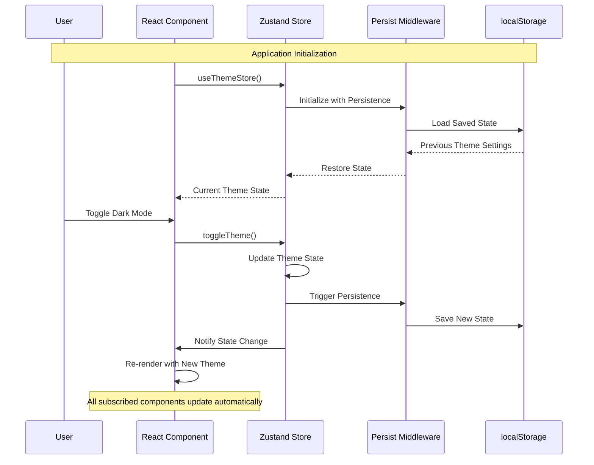
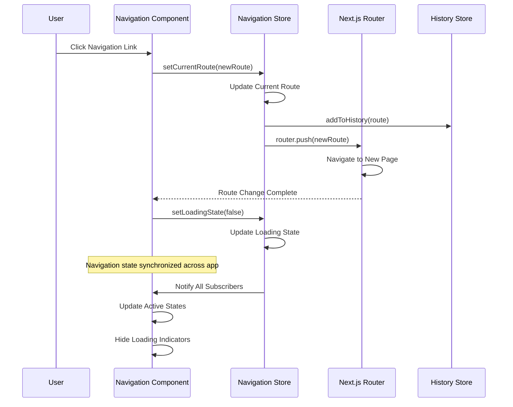
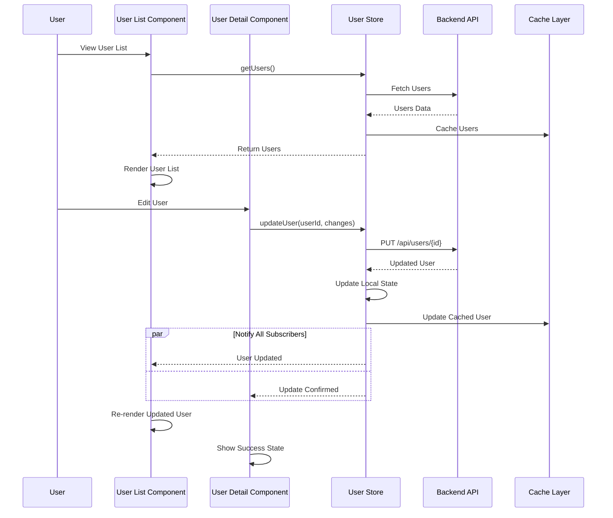
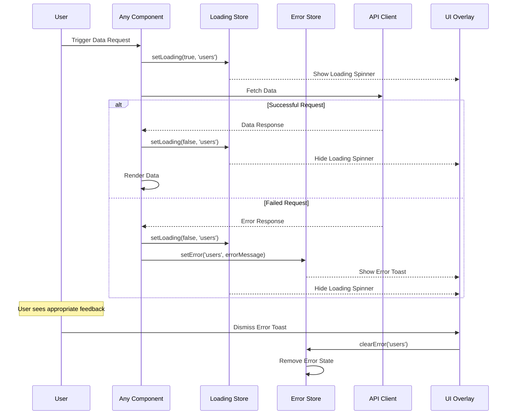
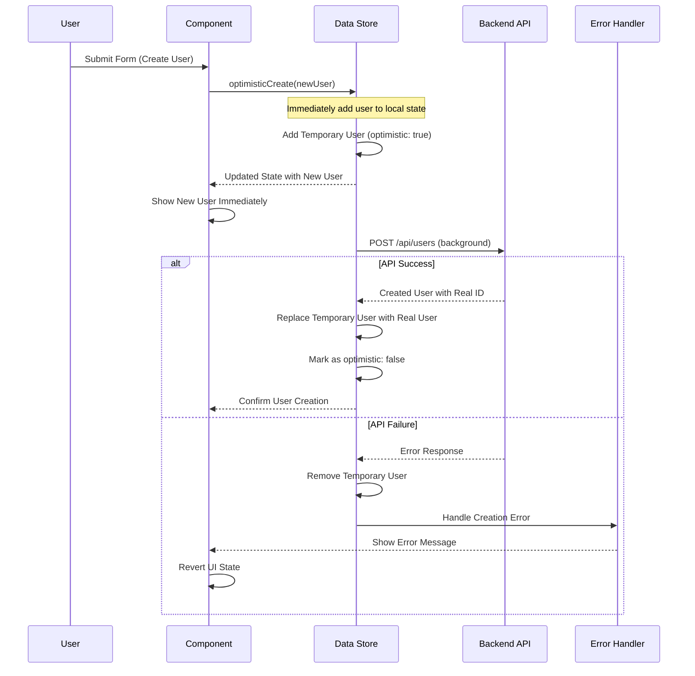
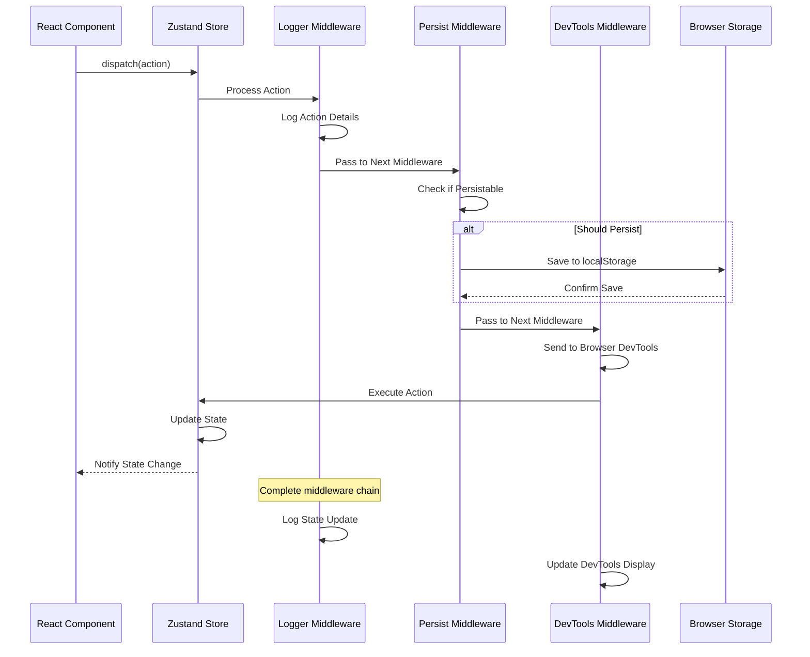

# State Management Sequence Diagrams

## 1. Zustand Store Integration



## 2. Navigation State Management



## 3. Real-time Data Synchronization



## 4. Global Loading and Error States



## 5. Optimistic Updates Pattern



## 6. Cross-Component State Synchronization

```mermade
sequenceDiagram
    participant HeaderComponent as Header Component
    participant SidebarComponent as Sidebar Component
    participant MainComponent as Main Component
    participant SharedStore as Shared Store
    participant ThemeStore as Theme Store
    
    Note over HeaderComponent,ThemeStore: Multiple components sharing state
    
    HeaderComponent->>ThemeStore: Subscribe to theme changes
    SidebarComponent->>ThemeStore: Subscribe to theme changes
    MainComponent->>ThemeStore: Subscribe to theme changes
    
    HeaderComponent->>SharedStore: Subscribe to user state
    SidebarComponent->>SharedStore: Subscribe to navigation state
    MainComponent->>SharedStore: Subscribe to data state
    
    Note over HeaderComponent: User changes theme in header
    HeaderComponent->>ThemeStore: setTheme('dark')
    ThemeStore->>ThemeStore: Update Theme State
    
    par Notify All Theme Subscribers
        ThemeStore-->>HeaderComponent: Theme Updated
        and
        ThemeStore-->>SidebarComponent: Theme Updated
        and
        ThemeStore-->>MainComponent: Theme Updated
    end
    
    HeaderComponent->>HeaderComponent: Update Header Styling
    SidebarComponent->>SidebarComponent: Update Sidebar Styling
    MainComponent->>MainComponent: Update Main Content Styling
    
    Note over HeaderComponent,MainComponent: All components stay synchronized
```

## 7. Middleware Chain Processing



## Key State Management Features

### Zustand Benefits

- **Minimal Boilerplate**: Simple store creation and usage
- **TypeScript Support**: Full type safety throughout
- **Middleware Support**: Extensible with plugins
- **Performance**: Selective subscriptions prevent unnecessary re-renders

### State Patterns

- **Global State**: Shared across all components
- **Local State**: Component-specific state
- **Derived State**: Computed values from base state
- **Optimistic Updates**: Immediate UI feedback

### Persistence

- **Auto-persistence**: Automatic state saving
- **Selective Persistence**: Choose what to persist
- **Hydration**: Restore state on app load
- **Migration**: Handle state schema changes

### Developer Experience

- **DevTools Integration**: Redux DevTools support
- **Time Travel Debugging**: Replay state changes
- **Action Logging**: Track all state mutations
- **Hot Reloading**: Preserve state during development

These state management patterns enable scalable, maintainable React applications with predictable state updates and excellent developer experience.
