# Webhook System Sequence Diagrams

## 1. Webhook Reception and Processing

## 2. Interactive Webhook Testing

```mermaid
sequenceDiagram
    participant User as User
    participant UI as Webhook UI
    participant API as Webhook API
    participant Store as In-Memory Store
    
    User->>UI: Select Quick Example
    UI->>UI: Populate Test Form
    User->>UI: Click "Send Test Webhook"
    
    UI->>API: POST /api/webhooks?source=demo&event=user.created
    Note over UI,API: Headers: Content-Type, X-Webhook-Signature
    
    API->>API: Process Webhook
    API->>Store: Store Test Event
    Store-->>API: Event Stored
    API-->>UI: 200 OK + Result
    
    UI->>UI: Show Success Message
    Note over UI: Auto-refresh triggers
    UI->>API: GET /api/webhooks?limit=50
    API-->>UI: Updated Event List
    UI->>UI: Display New Test Event
```

## 3. Real-time Event Monitoring

## 4. Webhook Event Filtering and Management

## 5. Multi-Service Webhook Integration

## 6. Error Handling and Recovery

## Key Features Demonstrated

### Event-Driven Architecture
- Asynchronous webhook processing
- Real-time event monitoring
- Multi-source event aggregation

### Security & Validation
- Signature verification
- Request validation
- Error handling and recovery

### User Experience
- Auto-refreshing interface
- Interactive testing tools
- Detailed event inspection
- Filtering and management

### Scalability Patterns
- Stateless API design
- Efficient event storage
- Pagination support
- Source-based filtering

These diagrams illustrate how the webhook system handles real-time event-driven communication, providing both educational value and practical functionality for modern web applications.
