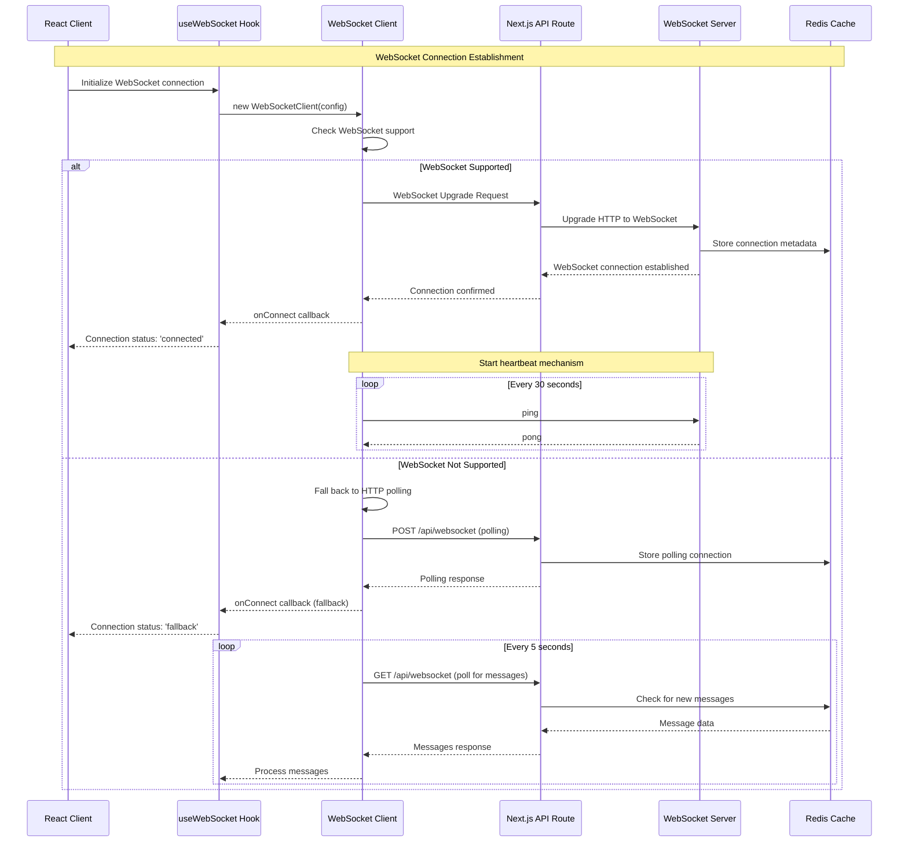
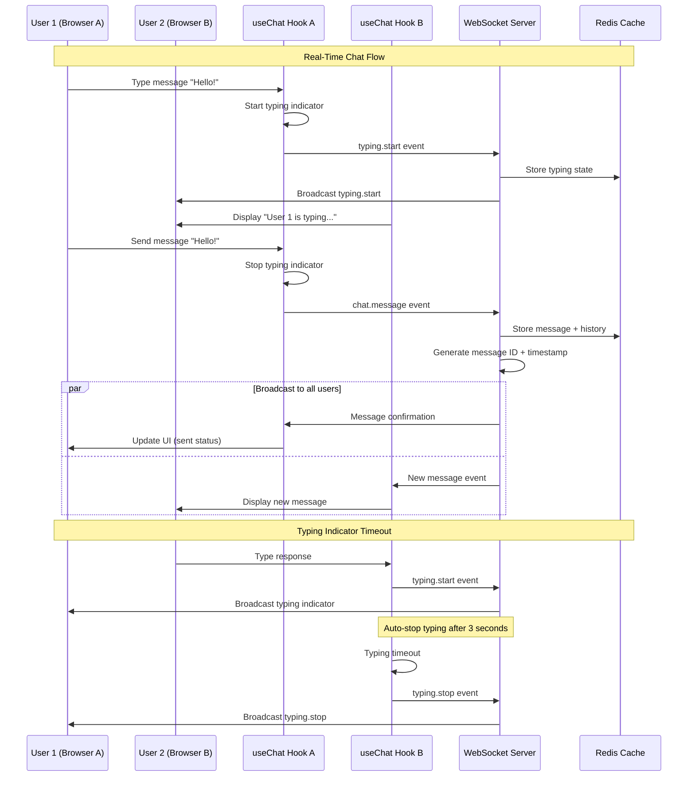
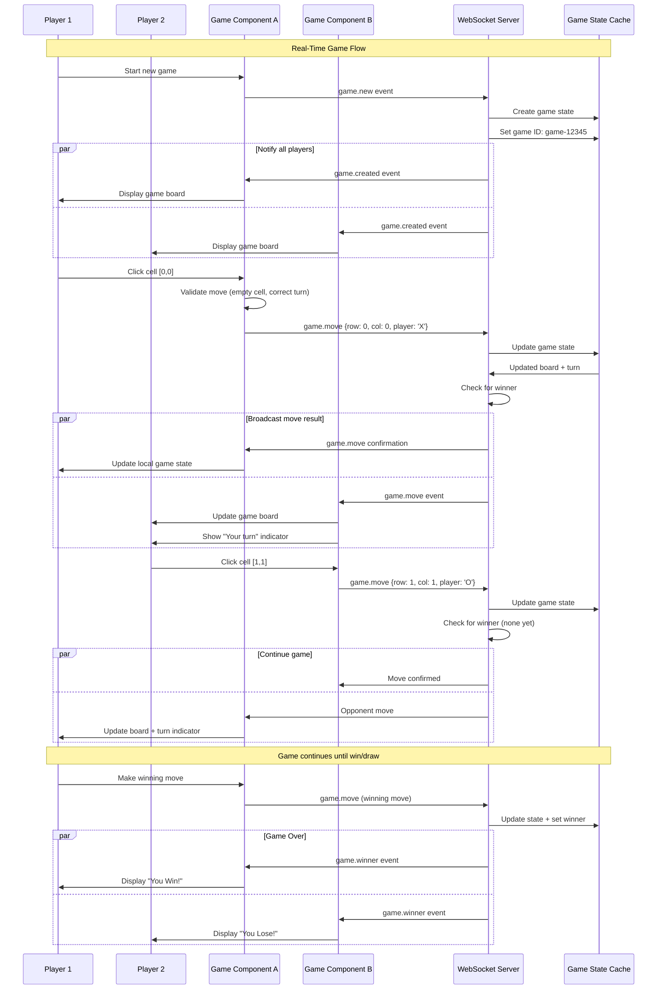
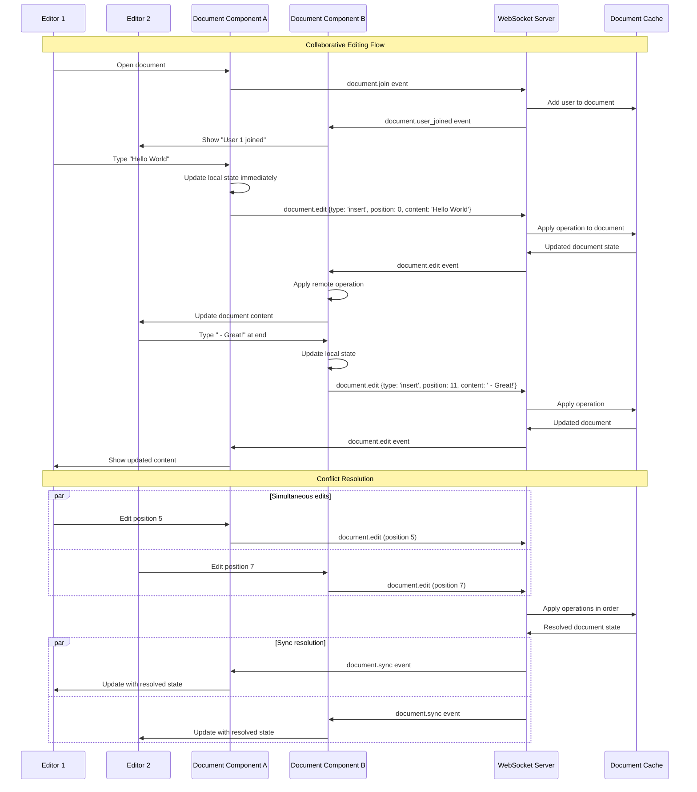
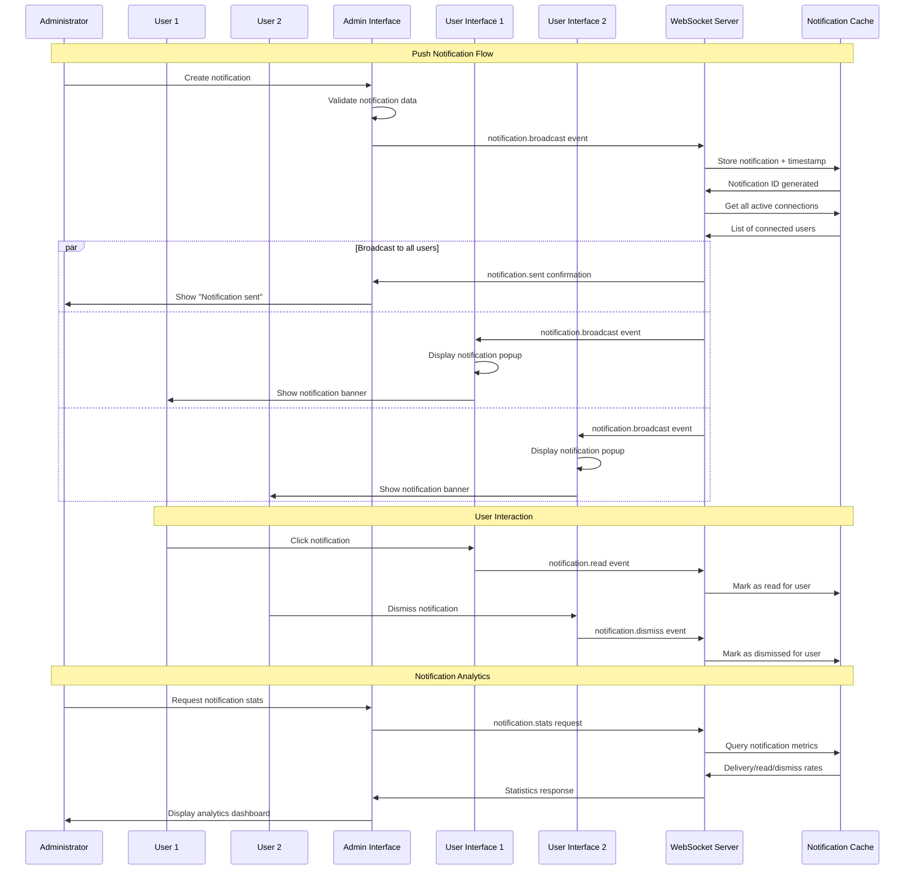
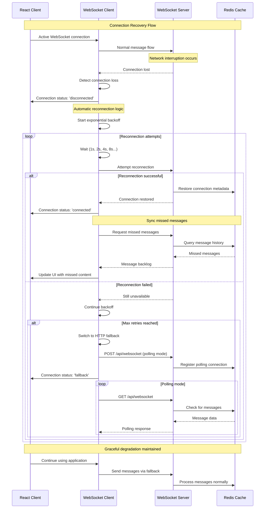
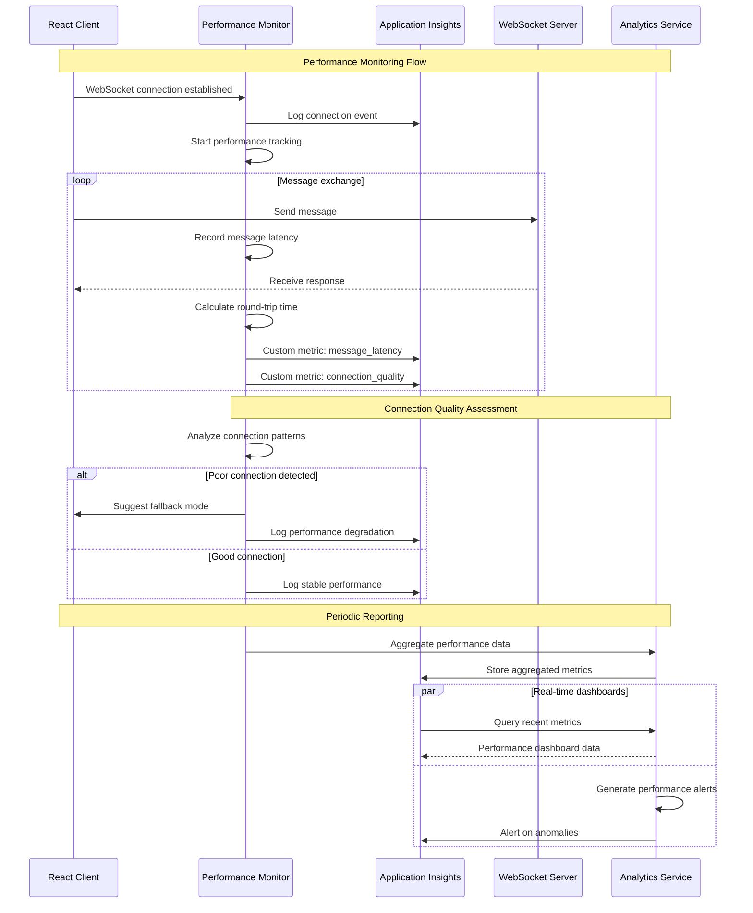

# WebSocket Real-Time Communication Sequence Diagrams

This document provides detailed sequence diagrams for the WebSocket implementation in the React + Java + Azure application, demonstrating real-time communication patterns.

## 🔄 WebSocket Connection Establishment

## 💬 Real-Time Chat Communication

## 🎮 Real-Time Gaming (Tic-Tac-Toe)

## 📝 Collaborative Document Editing

## 🔔 Push Notification Broadcasting

## 🔄 Connection Recovery & Resilience

## 📊 Performance Monitoring & Metrics

---

## 🎯 Key Implementation Benefits

### Real-Time Performance
- **Sub-second message delivery**: Optimized WebSocket implementation
- **Automatic failover**: Seamless fallback to HTTP polling
- **Connection pooling**: Efficient resource management

### Scalability Features
- **Redis clustering**: Horizontal scaling for connection state
- **Load balancing**: Multiple WebSocket server instances
- **Message queuing**: Reliable delivery guarantees

### Developer Experience
- **Type-safe hooks**: Full TypeScript integration
- **Error boundaries**: Graceful error handling
- **Hot reloading**: Development-friendly implementation

### Enterprise Features
- **Connection monitoring**: Real-time health checks
- **Performance metrics**: Application Insights integration
- **Security**: Message validation and rate limiting

This WebSocket implementation provides enterprise-grade real-time communication with comprehensive fallback strategies and monitoring capabilities.