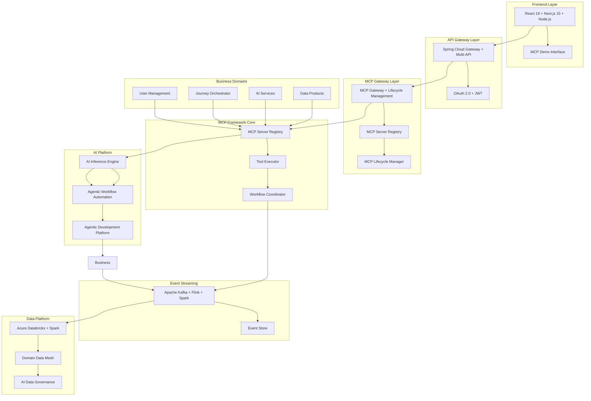
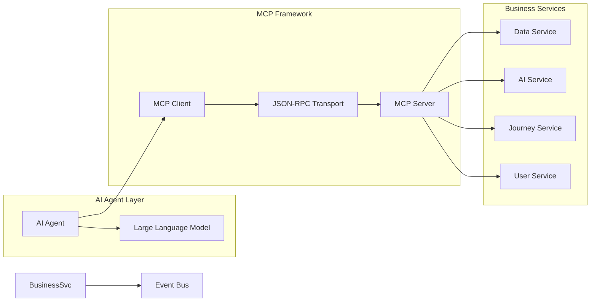
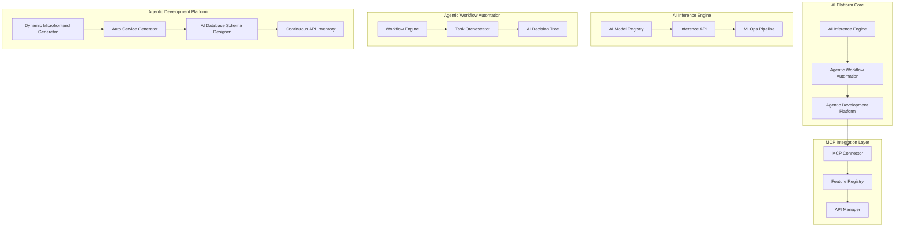
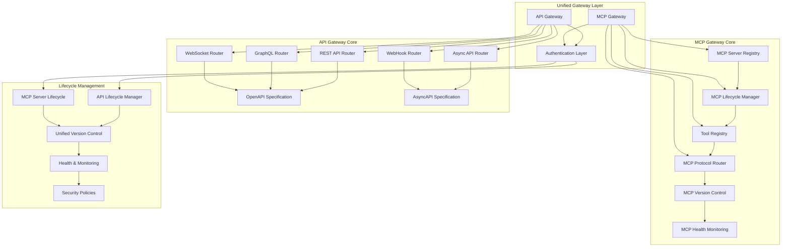
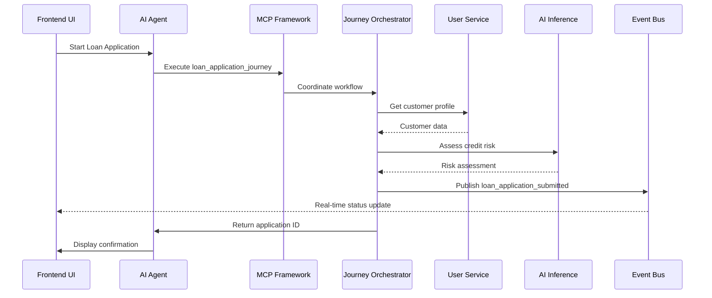
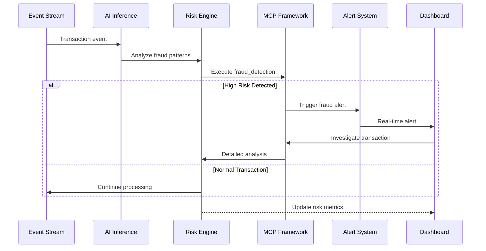
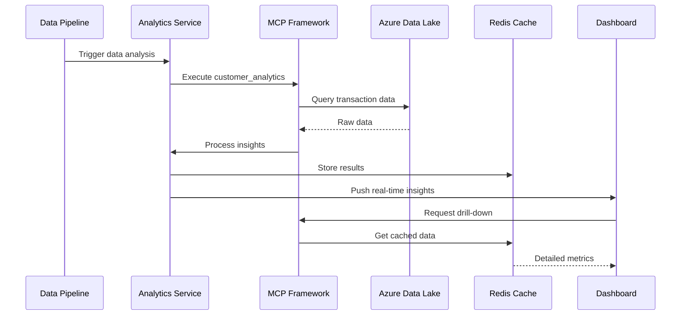

# AI Platform Technical Implementation

## Complete Development Repository - React, Java, Azure

This repository contains the **complete technical implementation** and **development artifacts** for the AI Platform for FinTech Evolution. It serves as the primary codebase for development teams, technical interviews, and engineering reference.

## 🎯 Repository Purpose

This repository is designed for:

- **👨‍💻 Development Teams & Software Engineers**
- **🔧 Technical Interviewers & Senior Developers**
- **⚙️ DevOps Engineers & Site Reliability Engineers**
- **🏗️ Solution Architects & System Designers**
- **🧪 QA Engineers & Test Automation Specialists**

## 🚀 Technical Platform Overview

This platform demonstrates production-ready implementation of:

- **MCP Framework**: Model Context Protocol for intelligent AI agent coordination
- **Agentic Automation**: Multi-domain orchestration with real-time decision making
- **Enterprise Architecture**: 13-layer enterprise-grade microservices architecture
- **Modern Full-Stack**: React 19 + Next.js 15, Java Spring Boot, Azure Cloud Platform
- **DevOps Excellence**: Complete CI/CD, Infrastructure as Code, monitoring, and observability

## 🏗️ System Architecture

### High-Level Architecture Overview



### MCP Framework Architecture



### AI Platform Architecture



### Unified Gateway Architecture



## 🔄 Sequence Diagrams

### Customer Journey Automation Flow



### Real-time Risk Management Flow



### Data-Driven Insights Flow



## 🚀 Quick Start

### Prerequisites

- **Java 17+**
- **Node.js 18+**
- **Docker & Docker Compose**
- **Azure CLI** (for cloud deployment)

### Local Development Setup

1. **Clone the repository**

   ```bash
   git clone https://github.com/calvinlee999/react_next_java_journey.git
   cd react_next_java_journey
   ```

2. **Start Backend Services**

   ```bash
   cd backend
   ./mvnw spring-boot:run
   ```

3. **Start Frontend**

   ```bash
   cd frontend
   npm install
   npm run dev
   ```

4. **Access Applications**
   - Frontend: <http://localhost:3000>
   - MCP Demo: <http://localhost:3000/mcp-demo>
   - Backend API: <http://localhost:8080>

### Using VS Code Tasks

The project includes pre-configured VS Code tasks:

```bash
# Start full stack development
Ctrl+Shift+P → "Tasks: Run Task" → "Start Full Stack"

# Build all services
Ctrl+Shift+P → "Tasks: Run Task" → "Build All Services"
```

## 📋 Features Implemented

### ✅ MCP Framework

- **Server Registry**: Dynamic tool discovery and registration
- **Tool Executor**: Type-safe execution with error handling
- **Workflow Coordinator**: Multi-domain orchestration
- **Real-time Events**: WebSocket-based status updates

### ✅ Business Domains

- **User Management**: CRUD operations with event sourcing
- **Journey Orchestration**: Agentic workflow automation
- **AI Inference**: Real-time and batch processing
- **Data Products**: Analytics and insights generation

### ✅ Frontend Demo

- **Interactive Dashboard**: Real-time MCP status monitoring
- **Customer Journey**: Loan application workflow simulation
- **Risk Management**: Fraud detection and portfolio analysis
- **Data Insights**: Customer analytics and transaction monitoring

### ✅ Enterprise Features

- **Security**: OAuth 2.0, JWT tokens, RBAC
- **Monitoring**: Application Insights, health checks
- **Caching**: Redis for performance optimization
- **Event Streaming**: Kafka + Flink + Spark for real-time, near real-time, and batch processing

## 🛠️ Technology Stack

### Frontend

- **React 19.1.0**: Latest React with concurrent features
- **Next.js 15.5.3**: Full-stack framework with SSR/SSG
- **TypeScript**: Type-safe development
- **Framer Motion**: Advanced animations
- **Tailwind CSS**: Utility-first styling

### Backend

- **Java 17**: Modern Java features
- **Spring Boot 3.2 + AI Journey Orchestrator + Domain MCP + Docker**: Intelligent microservices framework
- **Gateway Architecture**:
  - **API Gateway**: Spring Cloud Gateway supporting REST, Async, GraphQL, WebHooks, WebSockets with OpenAPI/AsyncAPI standards
  - **MCP Gateway**: Dedicated MCP server registry, lifecycle management, tool registry, and protocol routing
- **Apache Kafka + Flink + Spark**: Comprehensive event streaming and data processing platform
- **Redis**: High-performance caching

### AI Platform

- **AI Inference Engine**: Advanced machine learning model deployment and inference
  - Model Registry: Centralized AI model management
  - Inference API: High-performance model serving
  - MLOps Pipeline: Automated model lifecycle management
- **Agentic Workflow Automation**: Intelligent workflow orchestration
  - Workflow Engine: AI-driven process automation
  - Task Orchestrator: Dynamic task management
  - AI Decision Tree: Intelligent decision-making capabilities
- **Agentic Development Platform**: Autonomous development capabilities
  - Dynamic Microfrontend Generator: AI-generated UI components
  - Auto Service Generator: Automated microservice creation
  - AI Database Schema Designer: Intelligent schema design
  - Continuous API Inventory: Real-time API discovery and management
- **MCP Integration**: Seamless Model Context Protocol integration
  - Feature Registry: Centralized feature management
  - API Manager: Comprehensive API lifecycle management
  - Continuous Inventory: Real-time tracking of existing and new features/APIs

### Cloud & Infrastructure

- **Azure**: Primary cloud provider
- **Docker**: Containerization
- **Kubernetes**: Container orchestration
- **Azure Databricks**: Advanced analytics platform with Spark, Domain Data Mesh, AI-assisted data governance, lineage, data quality, scalability with partitioning, in-memory processing, and auto-scaling
- **Azure Blob Storage**: Object storage

## 🏢 Enterprise Architecture Patterns

### Microservices Architecture

- **API Gateway**: Multi-paradigm routing, authentication, and standards compliance (REST/Async/GraphQL/WebHooks/WebSockets)
- **Service Discovery**: Automatic service registration
- **Circuit Breaker**: Resilience patterns
- **Event Sourcing**: Audit trail and replay capability

### MCP Gateway Patterns

- **Dedicated MCP Layer**: Specialized gateway layer between API Gateway and MCP Framework
- **MCP Server Lifecycle Management**: Automated registration, discovery, and health monitoring of MCP servers
- **Tool Registry Management**: Dynamic tool discovery and version control for MCP tools
- **Protocol Routing**: Intelligent routing and translation of MCP protocol messages
- **MCP Version Control**: Backward compatibility and migration support for MCP protocol versions
- **Integration Bridge**: Seamless communication bridge between traditional APIs and MCP ecosystem
- **Health Monitoring**: Real-time monitoring of MCP server availability and performance

### Event-Driven Architecture

- **Domain Events**: Business event modeling
- **Event Streaming**: Real-time, near real-time, and batch data processing
- **CQRS**: Command Query Responsibility Segregation
- **Saga Pattern**: Distributed transaction management

### Security Architecture

```mermaid
graph TB
    subgraph "Security Perimeter"
        subgraph "External"
            Client[Web Client]
            Mobile[Mobile App]
            External[External APIs]
        end
        
        subgraph "Edge Security"
            WAF[Web Application Firewall]
            DDoS[DDoS Protection]
            CDN[CDN with SSL/TLS]
        end
        
        subgraph "Gateway Security Layer"
            APIGatewaySec[API Gateway Security]
            MCPGatewaySec[MCP Gateway Security]
            OAuth[OAuth 2.0/OIDC Provider]
            JWT[JWT Token Service]
        end
        
        subgraph "Platform Security"
            subgraph "Frontend Security"
                CSP[Content Security Policy]
                CORS[CORS Protection]
                TokenMgmt[Secure Token Management]
            end
            
            subgraph "MCP Framework Security"
                AgentAuth[Agent Authentication]
                ToolSandbox[Tool Execution Sandbox]
                ModelACL[AI Model Access Control]
            end
            
            subgraph "AI Platform Security"
                ModelAuth[Model Serving Auth]
                WorkflowSec[Workflow Security]
                DevPlatformACL[Development Platform ACL]
            end
            
            subgraph "Microservices Security"
                mTLS[Service-to-Service mTLS]
                ContainerSec[Container Security]
                ServiceMesh[Service Mesh Security]
            end
            
            subgraph "Event Security"
                KafkaEnc[Kafka Encryption]
                TopicACL[Topic Access Control]
                PayloadEnc[Payload Encryption]
            end
            
            subgraph "Data Security"
                DataEnc[Data Encryption]
                PIIDetection[PII Detection]
                DataLineage[Data Lineage Audit]
            end
        end
        
        subgraph "Identity & Access Management"
            AAD[Azure Active Directory]
            RBAC[Role-Based Access Control]
            PAM[Privileged Access Management]
        end
        
        subgraph "Compliance & Governance"
            GDPR[GDPR Compliance]
            PCIDSS[PCI DSS]
            SOX[SOX Compliance]
            AuditLogs[Audit Logging]
        end
        
        subgraph "Security Monitoring"
            SIEM[Security Information & Event Management]
            ThreatIntel[Threat Intelligence]
            Alerts[Real-time Security Alerts]
            Compliance[Compliance Monitoring]
        end
    end
    
    %% External to Edge
    Client --> WAF
    Mobile --> WAF
    External --> WAF
    WAF --> DDoS
    DDoS --> CDN
    
    %% Edge to Gateway
    CDN --> APIGatewaySec
    CDN --> MCPGatewaySec
    APIGatewaySec --> OAuth
    MCPGatewaySec --> OAuth
    OAuth --> JWT
    
    %% Gateway to Platform
    JWT --> CSP
    JWT --> AgentAuth
    JWT --> ModelAuth
    JWT --> mTLS
    JWT --> KafkaEnc
    JWT --> DataEnc
    
    %% Cross-layer Security
    AAD --> OAuth
    RBAC --> AgentAuth
    RBAC --> ModelAuth
    PAM --> mTLS
    
    %% Monitoring & Compliance
    AuditLogs --> SIEM
    GDPR --> Compliance
    PCIDSS --> Compliance
    SOX --> Compliance
    SIEM --> ThreatIntel
    ThreatIntel --> Alerts
```

#### Cross-Platform Security Management
- **Zero Trust Architecture**: Never trust, always verify across all platform layers
- **OAuth 2.0/OIDC**: Industry-standard authentication with OpenID Connect
- **JWT Tokens**: Stateless authorization with token-based security
- **RBAC**: Role-based access control with fine-grained permissions

#### Layer-Specific Security Implementation
- **Frontend Security**: 
  - CSP (Content Security Policy) and CORS protection
  - Client-side token management and secure storage
  - SSL/TLS encryption for all communications
- **API Gateway Security**:
  - API rate limiting and throttling
  - Request/response validation and sanitization
  - OAuth 2.0 token validation and JWT verification
- **MCP Gateway Security**:
  - MCP protocol security with encrypted connections
  - Tool access control and permission management
  - MCP server authentication and authorization
- **MCP Framework Security**:
  - Agent-to-agent secure communication
  - Tool execution sandboxing and isolation
  - AI model access control and audit logging
- **AI Platform Security**:
  - Model serving authentication and authorization
  - Workflow execution security and audit trails
  - Agentic development platform access controls
- **Microservices Security**:
  - Service-to-service authentication (mTLS)
  - Container security and image scanning
  - Network policies and service mesh security
- **Event Streaming Security**:
  - Kafka encryption in transit and at rest
  - Topic-level access control and ACLs
  - Event payload encryption and data masking
- **Data Platform Security**:
  - Azure Databricks workspace security
  - Data encryption at rest and in transit
  - Data lineage and access audit trails
  - PII detection and data classification

#### Compliance and Governance
- **IAM Integration**: Azure Active Directory for centralized identity management
- **Compliance Frameworks**: GDPR, PCI DSS, SOX, and HIPAA compliance
- **Audit and Monitoring**: Real-time security monitoring and compliance reporting
- **Data Governance**: Automated data classification and retention policies

## 📊 MCP Demo Features

### 1. Customer Journey Automation

- **Workflow Simulation**: Interactive loan application process
- **Multi-Domain Coordination**: User, credit, and risk services
- **Real-time Status**: Live workflow tracking
- **Agentic Decision Making**: AI-driven process optimization

### 2. Real-time Risk Management

- **Fraud Detection**: Transaction scoring in real-time
- **Portfolio Analysis**: Risk metrics and VaR calculations
- **Alert System**: Configurable risk thresholds
- **Investigation Tools**: Drill-down capabilities

### 3. Data-Driven Insights

- **Customer Analytics**: Behavior analysis and segmentation
- **Transaction Insights**: Real-time processing metrics
- **Data Products**: Reusable analytics components
- **Performance Monitoring**: System health and metrics

### 4. Agentic Workflow Monitor

- **Event Tracking**: Real-time workflow events
- **Agent Metrics**: Performance and execution statistics
- **Kafka Integration**: Event stream monitoring
- **Domain Filtering**: Focused monitoring views

## 🧪 Testing Strategy

### Unit Testing

```bash
# Backend unit tests
cd backend && ./mvnw test

# Frontend unit tests
cd frontend && npm test
```

### Integration Testing

```bash
# Run integration test suite
./scripts/run-integration-tests.sh
```

### End-to-End Testing

```bash
# Playwright E2E tests
cd frontend && npm run test:e2e
```

## 🚀 Deployment

### Local Docker Deployment

```bash
# Build and start all services
docker-compose up --build
```

### Azure Cloud Deployment

```bash
# Deploy infrastructure
cd infra
az deployment group create --resource-group fintech-rg --template-file main.bicep

# Deploy applications
./scripts/deploy-to-azure.sh
```

### Kubernetes Deployment

```bash
# Deploy to AKS cluster
kubectl apply -f k8s/
```

## 📈 Performance Benchmarks

### Response Times

- **API Gateway**: < 10ms median response time
- **MCP Tool Execution**: < 50ms for simple tools
- **Real-time Inference**: < 100ms for fraud detection
- **WebSocket Events**: < 5ms message delivery

### Throughput

- **API Requests**: 10,000+ requests/second
- **Event Processing**: 50,000+ events/second
- **Concurrent Users**: 1,000+ simultaneous connections
- **Database Queries**: 5,000+ queries/second

## 🔐 Security Features

### Authentication & Authorization

- **Multi-factor Authentication**: SMS and TOTP support
- **Session Management**: Secure token handling
- **API Rate Limiting**: DDoS protection
- **CORS Configuration**: Cross-origin security

### Data Protection

- **Encryption at Rest**: AES-256 encryption
- **Encryption in Transit**: TLS 1.3
- **Data Masking**: PII protection in logs
- **Audit Logging**: Complete audit trail

## 📚 Documentation

### Architecture Documentation

- [Complete System Architecture](docs/architecture/complete-system-architecture.md)
- [Microservices Architecture](docs/architecture/microservices-architecture.md)
- [Azure Cloud Architecture](docs/architecture/azure-cloud-architecture.md)

### Sequence Diagrams

- [Journey Orchestrator Flows](docs/sequence-diagrams/journey-orchestrator-flows.md)
- [AI Inference Sequences](docs/ai-inference-sequence-diagrams.md)
- [WebSocket System](docs/sequence-diagrams/websocket-system.md)

### Domain Documentation

- [MCP Framework Guide](backend/mcp-framework/README.md)
- [Frontend Development Guide](frontend/README.md)
- [Azure Deployment Guide](docs/azure/AZURE_LEVEL1_QUICK_START.md)

## 🤝 Contributing

### Development Workflow

1. Fork the repository
2. Create feature branch: `git checkout -b feature/amazing-feature`
3. Commit changes: `git commit -m 'Add amazing feature'`
4. Push branch: `git push origin feature/amazing-feature`
5. Create Pull Request

### Code Standards

- **Java**: Follow Google Java Style Guide
- **TypeScript**: Use ESLint + Prettier configuration
- **Git**: Conventional commit messages
- **Documentation**: Update relevant docs with changes

## 📄 License

This project is licensed under the MIT License - see the [LICENSE](LICENSE) file for details.

## 🎯 Roadmap

### Phase 1: Foundation ✅

- [x] MCP framework implementation
- [x] Core microservices
- [x] Frontend demo interface
- [x] Basic CI/CD pipeline

### Phase 2: Advanced Features 🚧

- [ ] Multi-tenant architecture
- [ ] Advanced AI models integration
- [ ] Blockchain integration
- [ ] Mobile application

### Phase 3: Enterprise Scale 📋

- [ ] Multi-region deployment
- [ ] Advanced analytics platform
- [ ] Compliance automation
- [ ] Performance optimization

## � Related Repositories

For **executive-level documentation** and **high-level architecture overview**, see:

- **[AI-Platform-for-FinTech-Evolution](https://github.com/calvinlee999/AI-Platform-for-FinTech-Evolution)** - Executive summary and strategic architecture overview for business stakeholders

## �👥 Development Team

- **Architecture**: Enterprise-grade system design and technical leadership
- **Backend**: Java/Spring Boot AI-powered microservices with journey orchestration
- **Frontend**: React/Next.js modern web development with micro-frontend architecture
- **DevOps**: Azure cloud infrastructure, CI/CD, and platform engineering
- **AI/ML**: Model Context Protocol implementation and intelligent automation
- **AI/ML**: Model Context Protocol and intelligent automation

---

## Built with ❤️ for the future of FinTech automation

For questions and support, please [open an issue](https://github.com/calvinlee999/react_next_java_journey/issues) or contact the development team.
